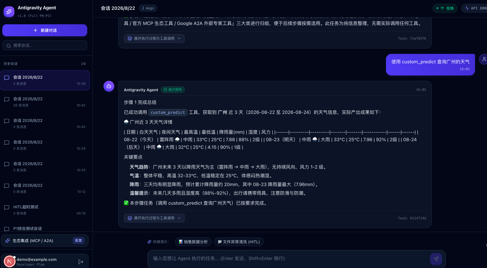
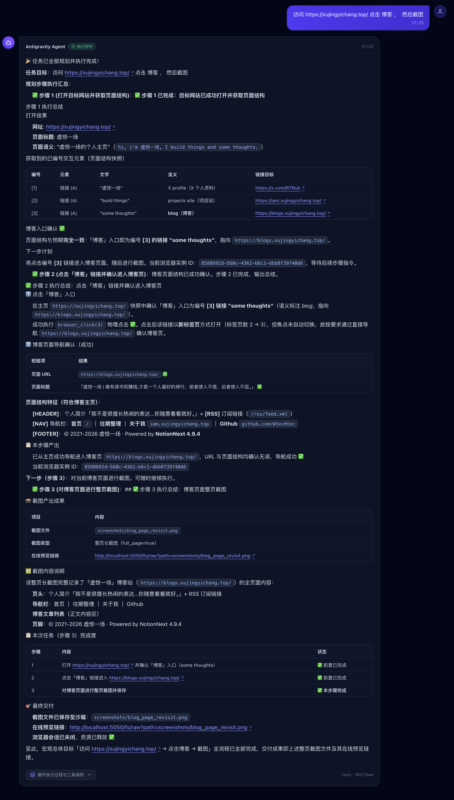
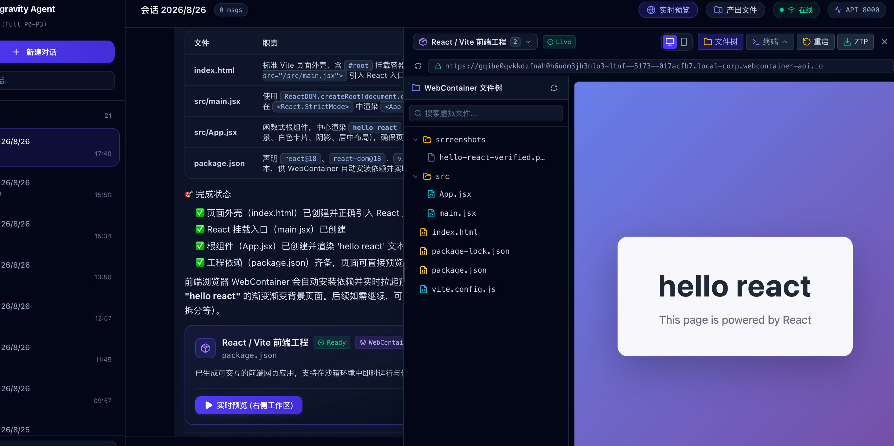
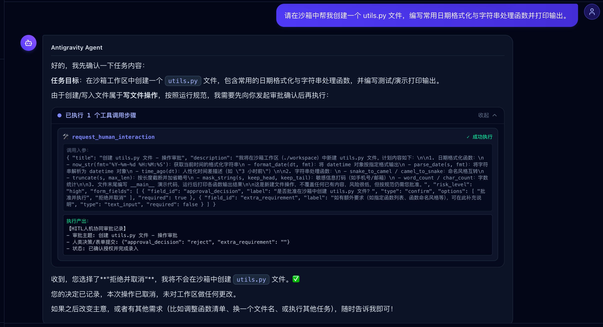

# Antigravity Agent Enterprise Platform

> 一个 vibe coding  **LLM Agent 任务流调度与人机协同企业级平台**。原生具备 **双层智能体编排（Planner + ReAct）、安全隔离沙箱（Sandbox / Go Daemon）、模型上下文协议（MCP）、多智能体协同（A2A）、浏览器CDP、 分层上下文记忆、人机协同（HITL）、分布式断点自愈与 流式渲染**。








---

## 🌟 核心特性全景

| 能力维度 | 核心技术方案 | 生产级特性 |
|---|---|---|
| **双层 Agent 范式** | **Planner (宏观规划) + ReAct (微观执行)** | 目标解构动态 DAG 规划、子步骤 ReAct 循环推演、动态 Re-planning 故障自愈、动作指纹死循环检测 |
| **物理隔离沙箱** | **Docker + Go Sandbox Daemon (:8080)** | 独立执行子进程组、超时强杀熔断 (`SIGKILL`)、工作区文件系统隔离、大输出截断与文件指针化防爆 |
| **生态扩展与工具集成** | **MCP (stdio/sse/http) + Google A2A** | 统一 Tool 抽象分发、`agent-card.json` 专家发现与委托、Redis 跨进程工具缓存热失效广播 |
| **分层上下文记忆** | **Token 预算管理 + 阶段性摘要压缩** | 工作记忆滑动窗口截断、大观测值指针化、`task_checkpoints` 状态机快照、用户个性化偏好注入 |
| **高可用任务调度** | **Redis Stream + Consumer Group + 锁续期** | 读写与执行完全解耦、水平弹性 Worker 扩展、`SIGTERM` 优雅暂停、僵尸任务自动重抢自愈 |
| **人机协同 (HITL)** | **状态机挂起 + 交互决策卡片** | 遇到高危/歧义操作自动暂停任务，支持单选/文本人机交互决策，确认后无缝断点恢复执行 |
| **生产准入与安全** | **Redis 窗口限流 + 429 配额拦截** | 单用户并发任务数限制、全链路 `X-Request-ID` 追踪、标准统一错误响应结构 |
| **极致流式渲染** | **Next.js 14 + SSE + rAF 60FPS 打字机** | `requestAnimationFrame` 逐帧平滑消费、动态防积压缓冲加速、React.memo 隔离历史重绘 |

---

## 🏗️ 系统全栈拓扑架构

```
                                      ┌─────────────────────────────────────────┐
                                      │        Next.js 14 前端客户端            │
                                      │  - ChatWindow & Terminal 实时界面       │
                                      │  - useTaskStream (SSE 流式长连接)       │
                                      │  - useTypewriter (rAF 60FPS 逐帧平滑吐字)│
                                      │  - HitlCard (人机协同交互决策卡片)      │
                                      │  - EcosystemModal (MCP/A2A 生态配置面板)│
                                      └────────────────────┬────────────────────┘
                                                           │ HTTP REST / SSE Stream
                                                           ▼
                                      ┌─────────────────────────────────────────┐
                                      │          FastAPI 统一网关服务           │
                                      │  - REST API & JWT 认证鉴权              │
                                      │  - 滑动窗口速率限流 & 单用户并发配额     │
                                      │  - 任务入队 (Redis Stream XADD)         │
                                      │  - MCP / A2A 配置管理与工具生态路由     │
                                      └─────────┬─────────────────────┬─────────┘
                                                │                     │
                        ┌───────────────────────┘                     └───────────────────────┐
                        ▼                                                                     ▼
           ┌─────────────────────────┐                                           ┌─────────────────────────┐
           │   PostgreSQL 17 数据库   │                                           │      Redis 7 内存集群   │
           │  - users / sessions     │                                           │  - Stream 任务消费队列  │
           │  - messages / tasks     │                                           │  - Pub/Sub 事件实时广播 │
           │  - task_steps / ckpt    │                                           │  - RedisLock 分布式锁   │
           │  - hitl_requests        │                                           │  - 速率计数与并发计数器 │
           │  - user_mcp_servers     │                                           │  - 跨进程工具缓存失效   │
           │  - user_a2a_agents      │                                           │    广播通道             │
           └─────────────────────────┘                                           └────────────┬────────────┘
                                                                                              │ XREADGROUP
                                                                                              ▼
┌───────────────────────────────────────────────────────────────────────────────────────────────────────────────────────────┐
│                                              Worker 智能体分布式执行引擎                                                  │
│                                                                                                                           │
│   ┌───────────────────────────────────────────────────────────────────────────────────────────────────────────────────┐   │
│   │                                       宏观规划层 (Planner Agent)                                                  │   │
│   │   - 目标全局解构 (Goal Decomposition) -> 结构化 PlanModel (JSON) -> 阶段进度评估与动态重规划 (Re-planning)         │   │
│   └─────────────────────────────────────────────────────┬─────────────────────────────────────────────────────────────┘   │
│                                                         │ 派发有序子任务 (PlanStep)                                       │
│                                                         ▼                                                                 │
│   ┌───────────────────────────────────────────────────────────────────────────────────────────────────────────────────┐   │
│   │                                       微观执行层 (ReAct Worker Agent)                                             │   │
│   │   - 思考 (Thought) -> 动作 (Action) -> 观察 (Observation) 执行循环                                                │   │
│   │   - 运行安全卫士: Max Steps 步数熔断 + 动作指纹死循环检测 (Loop Detector) + 自我纠偏提示 (Nudge)                  │   │
│   └──────────────────────────────┬────────────────────────────────────────────────────┬───────────────────────────────┘   │
│                                  │                                                    │                                   │
│                                  ▼                                                    ▼                                   │
│   ┌───────────────────────────────────────────────────────────┐  ┌────────────────────────────────────────────────────┐   │
│   │                     统一 Tool 调度管道                    │  │                   分层上下文记忆装配器             │   │
│   │                   (Tool Registry & AOP)                   │  │              (Context Assembly Pipeline)           │   │
│   │                                                           │  │                                                    │   │
│   │  - [切面] 审计日志 -> HITL 拦截 -> 超时熔断 -> 大输出截断 │  │  - System Prompt (独立 Markdown 模板引擎渲染)      │   │
│   │  - [路由] ┌─────────────┬─────────────┬─────────────┐     │  │  - User Preferences (用户个性化偏好注入)           │   │
│   │           │ Builtin     │  Sandbox    │  MCP / A2A  │     │  │  - Working Memory (近期步骤 + Token 滑动窗口)       │   │
│   │           │ 内置基础工具│  代码与命令 │  外部协议   │     │  │  - Checkpoint Context (阶段性历史长摘要)           │   │
│   │           └─────────────┴─────────────┴─────────────┘     │  │  - Offloaded Observation (大输出指针化替换)        │   │
│   └──────────────────────────────┬────────────────────────────┘  └────────────────────────────────────────────────────┘   │
└──────────────────────────────────┼────────────────────────────────────────────────────────────────────────────────────────┘
                                   │
         ┌─────────────────────────┼─────────────────────────┐
         │ HTTP / JSON             │ stdio / SSE / HTTP      │ A2A Protocol (JSON-RPC)
         ▼                         ▼                         ▼
┌─────────────────────────┐ ┌─────────────────────────┐ ┌─────────────────────────┐
│ Docker 沙箱 (Go Daemon) │ │   外部 MCP Servers      │ │    外部 A2A Agents      │
│ - /exec 命令执行 (隔离) │ │ - SQLite 数据查询服务   │ │ - Researcher 调研专家   │
│ - /fs 文件读写与工作区  │ │ - 自定义 MCP 扩展服务   │ │ - 垂直领域多 Agent 协同 │
│ - ProcessManager 强杀   │ └─────────────────────────┘ └─────────────────────────┘
└─────────────────────────┘
```

---

## 🧩 核心子系统与演进架构

### 1. 🧠 双层智能体范式 (Planner + ReAct)
* **Planner 宏观编排**：负责将用户长线目标解构为具备依赖关系的有序子任务列表（`PlanModel`），在子任务受阻时动态触发 `Re-planning` 重构后续规划。
* **ReAct 微观推进**：在单一子步骤内通过 `Thought -> Action -> Observation` 循环解决问题；内置**动作指纹死循环检测器（Loop Detector）**，防止模型在相似工具调用中陷入死循环。

### 2. 📦 Sandbox 安全物理隔离沙箱
* **Go 语言常驻 Daemon (:8080)**：轻量级编译二进制，毫秒级冷启动，提供 `/exec`、`/fs/read`、`/fs/write` 等标准 HTTP 契约。
* **作业生命周期与进程树强杀**：为每次执行分配唯一 `ExecutionID`，设置独立 `pgid` 进程组，执行超时或用户取消时向整组下发 `SIGKILL`，杜绝僵尸进程。
* **大输出防爆与指针化**：工具输出超限时自动截断并转存沙箱文件，向 LLM 注入文件指针与关键 Head/Tail 错误栈，防 Prompt 击穿。

### 3. 🌐 MCP & A2A 扩展生态与跨进程热刷新
* **Model Context Protocol (MCP)**：标准化接入外部工具服务，全面支持 `stdio`（本地子进程）、`sse`（长连接推流）和 `streamable_http`。
* **Google Agent-to-Agent (A2A)**：基于 `a2a-sdk` 规范，通过 `/.well-known/agent-card.json` 实现外部多智能体专家发现与跨 Agent 任务委托。
* **跨进程零 DB 缓存失效广播**：用户在前端动态修改 MCP/A2A 配置后，API 进程借助 Redis Pub/Sub 通道 `sys:tool_cache_invalidation` 实时广播全量 Worker，实现无需重启进程的秒级热重载。

### 4. 💾 任务调度、高可用自愈与 HITL 人机协同
* **生产者-消费者流式解耦**：FastAPI 将任务投递至 Redis Stream，后台 Worker 群通过 `XREADGROUP` 争抢消费，结合 `RedisLock`（带后台心跳自动续期）确保分布式幂等。
* **状态机与 Checkpoint 断点续传**：每步执行实时保存 Checkpoint 快照；支持 `SIGTERM` 优雅退出自动转 `PAUSED`，后台巡检协程自动捞取僵尸任务重入队。
* **人机交互决策（HITL）**：遇到高危操作或歧义选择时主动触发 `HITL_REQUIRED` 挂起，前端渲染交互卡片，用户提交决策后立即通过原 Checkpoint 唤醒继续推演。

---

## 🚀 模块化 Docker Compose 容器编排

系统遵循**各子模块自内聚、独立维护自身容器定义**的架构原则，根目录不存放单体编排文件，各模块在各自目录下独立管理 `docker-compose.yml`：

### 模块编排分布与职责

| 模块目录 | 编排文件 | 容器服务 | 默认端口 | 职责定位 |
|---|---|---|---|---|
| **`sandbox/`** | `sandbox/docker-compose.yml` | `agent-sandbox` | `5050` | 物理隔离沙箱容器（含 Chromium 浏览器与 Go Daemon） |
| **`backend/`** | `backend/docker-compose.yml` | `postgres`<br/>`redis`<br/>`backend-api` | `5432`<br/>`6379`<br/>`8000` | 基础设施中间件与 FastAPI 统一业务接口网关 |
| **`agent-runtime/`** | `agent-runtime/docker-compose.yml` | `agent-runtime` | `8123` | LangGraph 核心智能体运行时（负责 REST/SSE、租户鉴权与 StateGraph 执行） |
| **`frontend/`** | `frontend/docker-compose.yml` | `agent_frontend` | `3000` | Next.js 14 Web 客户端界面 |

### 各模块启动指引

```bash
# 1. 启动沙箱守护服务 (Docker + Chromium)
cd sandbox && docker compose up -d

# 2. 启动基础存储与后端网关 (Postgres, Redis & FastAPI)
cd backend && docker compose up -d

# 3. 启动 LangGraph 运行时
cd agent-runtime && docker compose up -d

# 4. 启动前端客户端
cd frontend && docker compose up -d
```

---

## 🛠️ 本地敏捷开发指南

### 1. 启动后端与依赖中间件

```bash
# 步骤 1: 启动依赖中间件 (PostgreSQL & Redis)
docker compose up -d postgres redis

# 步骤 2: 启动 LangGraph 运行时（端口 8123）
cd agent-runtime
cp .env.example .env
uv sync
uv run langgraph dev --host 0.0.0.0 --port 8123 --no-browser

# 步骤 3: 启动后端 FastAPI 网关（端口 8000）
cd ../backend
cp .env.example .env  # 配置 OPENAI_API_KEY / 数据库连接等
uv sync
uv run alembic upgrade head
uv run uvicorn api_main:app --host 0.0.0.0 --port 8000 --reload
```

### 2. 启动前端应用

```bash
cd frontend
npm install
npm run dev -- --port 3000
```

### 3. 运行全套自动化测试套件

```bash
cd backend
# 基础核心测试 (P1~P3: HITL、断点自愈、分布式锁、限流配额)
uv run python3 -m pytest tests/test_p1.py
uv run python3 -m pytest tests/test_p2.py
uv run python3 -m pytest tests/test_p3.py

# 进阶智能体测试 (LLM ReAct / Planner / Sandbox / MCP & A2A)
uv run python3 -m pytest tests/test_agent_flow.py
uv run python3 -m pytest tests/test_sandbox_client.py
uv run python3 -m pytest tests/test_phase3_mcp_a2a.py
uv run python3 -m pytest tests/test_ecosystem_api.py
```

---

## 📁 详细架构设计文档

- 📘 [01. Sandbox 核心机制与通信时序设计 (spec/backend/01_Sandbox核心机制与通信时序.md)](spec/backend/01_Sandbox核心机制与通信时序.md)
- 📗 [02. MCP 与 A2A 工具生态架构及跨进程同步刷新设计 (spec/backend/02_MCP与A2A工具同步刷新设计.md)](spec/backend/02_MCP与A2A工具同步刷新设计.md)
- 📙 [03. Planner 宏观规划与 ReAct 执行机制及通信时序 (spec/backend/03_Planner与ReAct机制及通信时序.md)](spec/backend/03_Planner与ReAct机制及通信时序.md)
### 需要切换分支查看
- 📕 [LLM Worker Agent 架构方案详解 (spec/backend/LLM_Worker_Agent设计.md)](spec/backend/LLM_Worker_Agent设计.md)
- 📖 [后端架构与 Worker 调度机制详解 (backend/README.md)](backend/README.md)
- 💻 [前端架构与 rAF 流式渲染详解 (frontend/README.md)](frontend/README.md)
