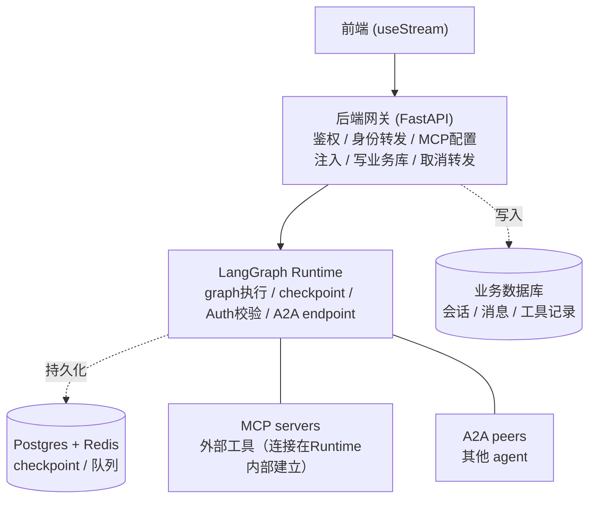

# LangGraph 多用户多任务生产部署设计方案

> 更新记录：本版新增「任务取消」章节——纠正 `useStream` 的 `stop()` 只是前端断连、不会真正停止后端 run 这一常见误区，给出网关侧的正确取消实现方式。

## 1. 背景与目标

本方案针对自托管 LangGraph 服务的生产部署，需要满足以下要求：

- 支持多用户、多任务并发
- 支持按用户/租户动态配置 MCP（Model Context Protocol）工具
- 支持 A2A（Agent-to-Agent）协议对外提供服务
- 支持 HITL（Human-in-the-Loop）人工审批流程
- 支持用户主动取消任务，且取消要真正停止后端执行，而不只是前端断开连接
- 会话信息、消息列表、工具调用记录需要沉淀为可查询的业务数据
- 具备应对流量峰值的能力，避免后端直连单点 LangGraph 服务造成瓶颈

## 2. 总体架构

采用「前端 → 后端网关 → LangGraph Runtime」三层结构，网关承担鉴权、多租户隔离、业务数据落库的职责，LangGraph Runtime 专注 graph 编排执行。



### 2.1 各层职责边界

| 层级 | 职责 | 不该做的事 |
|---|---|---|
| 前端 | 交互展示，通过 `useStream` 等官方 SDK 直连网关暴露的 LangGraph 协议路径，记录 `run_id` 以便发起真正的取消请求 | 不需要知道真实 LangGraph Server 地址与其访问凭证 |
| 后端网关 | 鉴权、限流、多租户校验、身份令牌转发、MCP 配置查询与注入、会话/消息/工具数据落库、A2A 路由准入控制、把取消请求转发为 LangGraph 的真实 cancel 调用 | 不做业务计算、不建立 MCP/A2A 真实连接、不重新实现任务队列 |
| LangGraph Runtime | graph 编排执行、状态 checkpoint、队列调度、身份校验与资源隔离（Auth）、MCP 工具真实连接与调用、A2A server、响应 run 级别的 cancel 指令 | 不感知你的用户体系细节、不负责业务数据的长期归档 |

### 2.2 判断某段逻辑该放哪一层的准则

一段处理逻辑的结果是否需要：
1. 被 checkpoint 记住？
2. 在 HITL 暂停后仍能恢复？
3. 出现在 LangSmith 的 trace 里？

只要有一个"是"，这段逻辑必须写成 LangGraph 里的 node 或 tool，不能放在网关。反之，鉴权、限流、路由决策、身份上下文注入这类横切关注点留在网关。**MCP/A2A 的真实连接与调用属于第 1/2/3 条全部命中的情形，必须在 LangGraph Runtime 内部完成，网关只负责把「谁能用、能用哪些」这份配置数据查出来并注入。**

## 3. 部署与任务队列

### 3.1 LangGraph Server 内置队列架构（无需自建 Celery/RQ）

- **API Server**：接收请求，将 run 快速写入 Postgres 后立即返回 run_id，不等待执行完成
- **Queue Worker**：通过 Redis 的 `BLPOP` 原子出队执行 run，worker 崩溃时任务不丢失
- **Redis**：存储 run 执行期间的瞬时状态，承担流式输出的 pub/sub
- **Postgres**：持久化所有数据（run、thread、assistant、checkpoint）

可用并发 = `queue worker 数量 × N_JOBS_PER_WORKER`（默认 10）。IO 密集型 graph 可调高 `N_JOBS_PER_WORKER`，CPU 密集型保持默认或调低；避免因过高并发导致队列利用率不均、执行时间变长。**这是整套系统吞吐的硬约束——网关层无论如何优化，都无法绕开这一层的并发上限，必须单独扩容 queue worker。**

### 3.2 API 与 Queue Worker 拆分部署

生产环境启用 `queue.enabled: true`，将两层拆分为可独立扩缩容的服务：

- **API 层**：按请求 QPS / CPU 配置 HPA
- **Queue Worker 层**：按队列积压长度 / CPU 配置 HPA，专门应对突发、写密集型流量

```
[反向代理/LB]（TLS、限流、需放宽SSE长连接的idle timeout）
      │
      ▼
[LangGraph API Server]（多副本）──┐
      │                          │
      ▼                          ▼
[Postgres(HA)]              [Redis]
      ▲
      │
[Queue Worker]（独立副本组，单独 HPA）
```

### 3.3 裸用 `langgraph up` / 单实例部署的问题

- 单进程、无自动扩缩容，峰值直接顶到单实例资源上限
- 生产使用 `langgraph up` 需要 license key，本身不是为长期裸跑设计的
- 无内置 LB/限流，后端直连单点没有缓冲层
- 无优雅停机配置，滚动更新时容易中断正在执行的 run
- 默认 Postgres/Redis 是单点，无高可用

## 4. 网关层设计

### 4.1 网关模式选择

| 模式 | 说明 | 适用场景 |
|---|---|---|
| A. 透明代理 | 网关只做鉴权/限流/TLS，请求体透传给 LangGraph，前端直接使用官方 SDK/协议 | AI 是产品唯一形态，团队想复用官方组件 |
| B. 封装转发 | 网关定义自己的业务 REST API，内部用 SDK 调用 LangGraph，屏蔽协议细节 | 已有业务系统、多租户、需要业务化数据落库 |

结论：本方案整体采用**「协议对齐、内容拦截」的折中形态**——对外路径和协议与 LangGraph Server 保持一致（前端可以直接用 `useStream` 等官方 SDK，无需改造），但网关在请求进出的两个环节插入鉴权、身份转发、配置注入、异步落库、取消转发这几个钩子，不是纯模式 A 的哑代理，也不是模式 B 那种完全自定义协议的封装。**A2A 这条路由仍采用纯透传方式**——LangGraph Server 已原生实现 A2A JSON-RPC 协议，网关只做调用方鉴权和准入控制。

### 4.2 网关侧流式代理实现

前端典型调用方式（以 React 为例）：

```javascript
const stream = useStream({
  apiUrl: API_URL,       // 指向网关，不是真实 LangGraph 地址
  assistantId: "agent",
  threadId: currentThreadId || undefined,
  onCreated: (run) => {
    // 关键：拿到真正的 run_id，取消/断线重连都要靠它
    setCurrentRunId(run.run_id);
  },
});

// 正常提交
stream.submit({ messages: [...] });

// HITL 恢复：thread_id 不变，input 换成 command
stream.submit(null, {
  command: { resume: { decisions: [{ type: "approve" }] } }
});
```

网关侧需要保持与 LangGraph 原生协议一致的路径（如 `/threads/{thread_id}/runs/stream`），在转发前后插入以下处理：

```python
from fastapi import FastAPI, Request, Depends
from fastapi.responses import StreamingResponse
import httpx, asyncio

app = FastAPI()
LANGGRAPH_UPSTREAM = "http://langgraph-server:8123"

@app.on_event("startup")
async def startup():
    # 全局共享 client + 连接池上限，避免每请求新建连接
    limits = httpx.Limits(max_connections=200, max_keepalive_connections=50)
    app.state.http_client = httpx.AsyncClient(limits=limits, timeout=httpx.Timeout(connect=5, read=None))
    # 固定数量的落库消费者，避免无界 create_task
    app.state.persist_queue = asyncio.Queue(maxsize=5000)
    for _ in range(10):
        asyncio.create_task(persist_worker(app.state.persist_queue))

@app.post("/threads/{thread_id}/runs/stream")
async def proxy_run_stream(thread_id: str, request: Request, user=Depends(get_current_user)):
    # 1. resume 场景必须校验 thread 归属，防止越权访问他人会话
    await assert_thread_belongs_to_user(thread_id, user.id)

    body = await request.json()
    body.setdefault("config", {}).setdefault("configurable", {}).update({
        "mcp_servers": await get_user_mcp_config(user.id),
    })

    internal_token = mint_internal_jwt(user_id=user.id, ttl_seconds=60)
    run_id_holder = {}

    async def event_stream():
        client = app.state.http_client
        async with client.stream(
            "POST",
            f"{LANGGRAPH_UPSTREAM}/threads/{thread_id}/runs/stream",
            json=body,
            headers={"Authorization": f"Bearer {internal_token}"},
        ) as resp:
            async for chunk in resp.aiter_bytes():
                # 记录 run_id，供后台断线检测时调用取消（见第7节）
                maybe_capture_run_id(chunk, run_id_holder)
                yield chunk
                try:
                    app.state.persist_queue.put_nowait((thread_id, user.id, chunk))
                except asyncio.QueueFull:
                    logger.warning("persist queue full, dropping chunk; 依赖run结束后的补全同步兜底")
                # 检测前端是否已断开，断开则触发真正的取消（见 7.3）
                if await request.is_disconnected():
                    await cancel_run_on_langgraph(thread_id, run_id_holder.get("run_id"), reason="client_disconnected")
                    break

    return StreamingResponse(event_stream(), media_type="text/event-stream")

async def persist_worker(queue: asyncio.Queue):
    while True:
        item = await queue.get()
        try:
            await parse_and_persist(*item)
        except Exception:
            logger.exception("persist failed")
        finally:
            queue.task_done()
```

### 4.3 高并发场景的检查清单

几百个并发 SSE 连接同时进入网关时，需要逐层检查以下瓶颈：

| 检查点 | 问题 | 修复 |
|---|---|---|
| httpx client | 每请求新建，无连接复用 | 全局共享 client + 连接池 `Limits` |
| 落库任务 | 无界 `asyncio.create_task` | 有界队列 + 固定数量消费者协程，或外部消息队列 |
| DB 写入 | 无池化连接，并发写入打满 Postgres 连接数 | 异步连接池（如 `asyncpg.create_pool`），按消费者并发数配置 |
| 进程/副本数 | 单进程扛全部长连接 | 多 worker/多副本 + LB |
| LB 超时 | HITL 场景连接可能挂起很久，被空闲超时掐断 | 调大 idle timeout，或定期发送 SSE 心跳 |
| LangGraph 执行侧 | queue worker 数固定，是硬约束 | 单独扩容 queue worker（网关优化解决不了这一层） |

### 4.4 落库队列选型：RabbitMQ / Redis Streams / 内存队列

将落库任务从内存 `asyncio.Queue` 换成外部消息队列，能解决持久化、跨进程解耦、精细背压这几个问题，但**只解决网关内部落库这一个环节**，不能替代前面清单里的其他优化，更不能替代 LangGraph 自身 queue worker 的扩容。

| 场景 | 建议 |
|---|---|
| 已有 RabbitMQ 基础设施、需要死信队列/优先级等复杂路由 | 用 RabbitMQ |
| 技术栈已依赖 Redis（LangGraph 本身就需要）、想少运维一套中间件 | 用 Redis Streams |
| 数据量大、需要长期保留、接数据仓库/流式分析 | 考虑 Kafka（落库场景通常是过度设计） |
| 流量不大、快速验证阶段 | 有界 `asyncio.Queue` + 固定消费者协程即可，遇到瓶颈再升级 |

### 4.5 MCP / A2A 的执行位置边界

- **网关只拉取配置数据**：用户配置了哪些 MCP server 地址、哪些 A2A peer 地址，这类元数据存在业务库，网关查询后注入到 `config.configurable`。
- **真实连接与调用在 LangGraph Runtime 内部完成**：graph 的 node 在执行时从 `config.configurable` 读取这份配置，动态建立 MCP 连接、拉取工具 schema、绑定到模型；A2A 的主动委托同理，写成 graph 内部的 tool/node。

```python
# 网关：只准备配置数据
body["config"]["configurable"]["mcp_servers"] = await get_user_mcp_config(user.id)
```

```python
# LangGraph：真正建立连接、调用工具都在 node 内部，被 checkpoint 记录
from langchain_mcp_adapters.client import MultiServerMCPClient

async def agent_node(state, config):
    mcp_servers = config["configurable"].get("mcp_servers", {})
    async with MultiServerMCPClient(mcp_servers) as client:
        tools = await client.get_tools()
        result = await model.bind_tools(tools).ainvoke(state["messages"])
    return {"messages": [result]}
```

- **A2A 作为 Server（被外部 agent 调用）**：直接用 LangGraph 原生 A2A endpoint（`metadata.a2a` 按 assistant 配置，`langgraph.json` 的 `http.disable_a2a` 可整体关闭），网关这条路由只做鉴权和限流的透传。
- **A2A 作为 Client（主动委托其他 agent）**：属于 graph 内部业务逻辑，目标地址若因租户而异，同样由网关查出后注入 `config.configurable`。

不这样做的代价：网关若自行完成 MCP/A2A 调用，这个过程不会被 checkpoint 记录，HITL 无法在这一步暂停，LangSmith 的 trace 也会断层。

## 5. 数据分层

业务数据分为两份，归属不同存储，不可混淆：

| 数据 | 归属 | 说明 |
|---|---|---|
| graph 执行状态、checkpoint、interrupt 现场 | LangGraph 自身 Postgres | 由 checkpointer 自动写入，业务代码不直接读取其内部表结构，一律通过 SDK 获取 |
| 会话目录、消息列表、工具调用记录（面向产品/分析） | 业务数据库 | 需要与 user/tenant 表 join、支持列表页查询、审计、BI 分析 |

### 5.1 消息数据、工具调用数据入库方式

由**网关层在转发 stream 事件给前端的同时，异步增量写入**（具体实现见 4.2）：

1. 网关订阅 LangGraph 的细粒度事件流（`astream_events`）
2. 遇到消息完成事件（如 `on_chat_model_end`）→ 写入 `messages` 表
3. 遇到 `on_tool_start` → 插入一条 pending 状态的 `tool_calls` 记录；遇到 `on_tool_end` → 更新为 completed/failed，附带耗时和结果
4. 使用 LangGraph 的 message id / tool_call_id 作为业务表唯一键，保证幂等
5. run 结束后，异步拉取该 thread 的完整历史做一次补全同步，兜底 stream 中途断连或队列丢弃导致的丢失窗口
6. 写库动作不阻塞主响应链路，采用有界队列 + 固定消费者的异步方式（见 4.4）
7. **`messages`/`runs` 表的状态字段需要包含 `cancelled`**（不只是 `completed`/`failed`），取消时把当前已流式输出的内容原样落定，并把仍处于 pending 状态的 `tool_calls` 一并标记为 `cancelled`，避免出现永远停在 pending 的脏数据（详见第 7 节）

### 5.2 会话目录同步

网关在创建 thread 时，除了转发给 LangGraph 创建 thread，同时在业务库插入一条会话记录（`thread_id` 作为外键、`user_id`、标题、创建时间等），保证列表查询走自己的库，具体内容按需再拉 LangGraph 详情。

### 5.3 强合规场景的例外

若某些 tool（如金融打款类操作）要求"执行即留痕、不能有丢失窗口"，可在 graph 内部给该 tool 包一层 callback handler，同步写入审计库，不依赖网关异步消费 stream 的方式。该模式仅用于关键操作，不作为默认方案。

## 6. HITL 设计

### 6.1 前端调用方式

`useStream` 首次提交传 `input`，恢复时 `thread_id` 保持不变，`input` 换成 `command`：

```javascript
stream.submit(null, {
  command: { resume: { decisions: [{ type: "approve" }] } }
});
```

### 6.2 后端机制

- graph 内 `interrupt()` 暂停执行，状态被 checkpoint 到 Postgres，`resumable` 标记该中断可恢复
- resume 动作本质是对**同一个 thread_id** 发起新的 run 请求，`input` 换成 `command=Command(resume=...)`
- 网关这条路由保持与创建 run 相同的协议路径，转发前必须校验 thread 归属（4.2 中的 `assert_thread_belongs_to_user`），防止越权操作他人会话的审批
- 多个并行 interrupt 同时发生时，resume 需要按 interrupt ID 分别映射，不能只传单一值
- 设计 graph 时建议把 `interrupt()` 放在 node 最前面，避免 resume 后重放非确定性代码（如重复调用付费 API）

## 7. 任务取消设计

### 7.1 常见误区：前端断连不等于后端停止执行

`useStream` 提供的 `stop()` 方法（或者手动 abort fetch）**只是断开前端到网关这条 HTTP/SSE 连接**，不会让 LangGraph 的 queue worker 停止执行——这是一个真实存在、社区反复踩坑的问题：worker 依然在跑，仍会持续消耗计算资源、继续调用工具（包括可能有副作用的工具），只是前端不再收到任何输出。如果只做前端断连，用户点了"停止"，后台任务其实还在继续跑，这明显不符合预期。

### 7.2 正确方式：显式调用 LangGraph 的 run 级别 cancel API

LangGraph Server 提供了真正的服务端取消接口，按 `thread_id` + `run_id` 定位到具体的 run，通知 queue worker 停止执行：

```python
from langgraph_sdk import get_client

client = get_client(url=LANGGRAPH_UPSTREAM)
await client.runs.cancel(
    thread_id=thread_id,
    run_id=run_id,
    wait=True,          # 阻塞直到真正取消完成，便于确认最终状态
    action="interrupt",  # interrupt：停止执行但保留run记录和已有checkpoint，可用于审计/调试
)
```

`action` 有两种取值：
- **`interrupt`（默认）**：停止 worker 执行，run 状态标记为 `interrupted`，run 记录和已完成的 checkpoint 都保留，可以事后查询这次执行到哪一步、输出了什么——推荐作为用户主动取消场景的默认选项。
- **`rollback`**：连同这次 run 一起回滚，用于希望彻底清除这次执行痕迹的场景。

也支持按 `thread_id` 或按状态（`pending`/`running`/`all`）批量取消，适合运维场景（比如下线某个租户时清理其所有在跑任务）。

### 7.3 网关侧要做的两件事

**（1）暴露一个专门的取消端点，前端主动点击"停止"时调用**

```python
@app.post("/threads/{thread_id}/runs/{run_id}/cancel")
async def cancel_run(thread_id: str, run_id: str, user=Depends(get_current_user)):
    await assert_thread_belongs_to_user(thread_id, user.id)
    await client.runs.cancel(thread_id=thread_id, run_id=run_id, wait=True, action="interrupt")
    await mark_message_cancelled_in_business_db(thread_id, run_id)  # 见 7.4
    return {"status": "cancelled"}
```

前端拿到 `onCreated` 回调里的 `run_id`（见 4.2），点击停止按钮时调用这个端点，而不是只调用 `stream.stop()`；`stream.stop()` 仍然有用——它能让前端 UI 立刻停止渲染 token，但必须和后端 cancel 调用**同时触发**，二者缺一不可。

**（2）检测被动断连（用户直接关闭浏览器/网络中断），同样触发取消**

如果用户没有点停止按钮，而是直接关掉页面或网络中断，网关侧的 SSE 生成器要能感知到这一点并触发同样的取消流程（见 4.2 代码里的 `request.is_disconnected()` 检测）。这里有一个权衡：**要不要加一段宽限期再真正取消**——移动网络场景下短暂断连很常见（切后台、信号波动），如果一断连就立刻 cancel，可能误杀本该继续跑、稍后还会重连的任务。建议：检测到断连后不立刻 cancel，等待一个宽限窗口（如 10-30 秒），期间前端若重新建立连接（走 `stream.joinStream(run_id)` 重新挂载到同一个 run）则取消计时器；宽限期结束仍未重连，才真正调用 cancel。

### 7.4 取消后的业务数据处理

- 已经流式输出、但可能尚未被 LangGraph 自身 checkpoint 记录的内容，**以网关侧异步落库的实时副本为准**（见 5.1）——这是已知的官方限制：取消发生在两次 checkpoint 之间时，LangGraph 自己的 checkpoint 里不会保留这段增量内容，但网关在转发 stream 时已经把这些 token 落进了业务库,所以业务库这份数据反而比 LangGraph 自己的 checkpoint 更完整,取消后应以业务库记录作为对用户展示历史的权威来源。
- 取消时把该 run 对应的 `messages` 记录状态标记为 `cancelled`，内容保留已流出的部分（不删除，作为部分结果展示）
- 所有仍处于 `pending` 状态的 `tool_calls` 记录一并标记为 `cancelled`，避免出现永远停在"执行中"的脏数据，便于后续排查和展示

### 7.5 已知限制：cancel 不保证瞬时打断所有副作用

`interrupt` 本质是取消 worker 里执行这个 run 的 asyncio task。如果 graph/tool 的代码是规范的异步实现（`await` 外部调用，如 MCP 工具调用、A2A 调用、LLM 请求），取消会通过 `CancelledError` 正常传播，及时中断这些进行中的调用。但如果某个 tool 内部用了阻塞式同步调用（比如通过 `asyncio.to_thread` 包裹一个耗时的同步 HTTP 请求），线程内的同步调用一旦发出就无法被 Python 提前打断，会一直等到它自然返回——这意味着：**graph/tool 代码是否规范使用异步操作，直接决定了 cancel 能不能做到"立即真正停止"，而不仅仅是标记状态**。这一点在设计工具时需要作为强制要求写进开发规范。

## 8. 多用户 / 多租户隔离

- **Thread**：每个用户的每次会话对应一个 `thread_id`，各自独立持久化状态
- **Assistant**：不同用户/场景需要不同 graph 配置时，用不同 `assistant_id` 区分
- **身份隔离**：见第 11 节，通过 LangGraph 原生 Auth 机制在协议层强制隔离，网关鉴权作为第一道防线，Auth 机制作为第二道防线（纵深防御）

## 9. 已知风险与注意事项

- `N_JOBS_PER_WORKER` 调过高在突发流量下会导致 worker 利用率不均，需结合 graph 的 IO/CPU 特征调优
- HITL 存在已知问题：多中断场景下 resume 绑定可能出现错位，混合"自动执行工具"与"审批工具"的 node 建议拆分
- 不要直接查询 LangGraph 内部 Postgres 表结构，非公开稳定契约，版本升级可能变更
- 网关异步落库为最终一致，非强一致，强合规场景需走 5.3 的同步审计方案
- 每次 run 都重新建立 MCP 连接有握手开销，同一用户高频对话场景可在 Runtime 内维护按用户/配置哈希做 key 的连接缓存池
- **`stream.stop()` 或前端 abort 请求不等于后端任务停止，必须显式调用 `runs.cancel`（第 7 节），否则会出现"用户以为取消了、后台仍在跑并持续消耗资源/产生副作用"的问题**
- **取消存在已知的状态丢失窗口**：LangGraph 自身 checkpoint 只在完整步骤结束时写入，取消时两次 checkpoint 之间已流出但未持久化的内容会在 LangGraph 侧丢失，需依赖网关的实时落库副本兜底（见 7.4）
- 工具实现必须使用规范的异步调用，阻塞式同步调用会削弱 cancel 的实时性（见 7.5）

## 10. 附录：关键配置项

| 配置项 | 说明 | 默认值 |
|---|---|---|
| `N_JOBS_PER_WORKER` | 单个 queue worker 并发执行的 run 数 | 10 |
| `queue.enabled` | 是否将 queue worker 从 API server 拆分为独立服务 | 需显式开启 |
| `BG_JOB_MAX_RETRIES` | 后台 run 失败后的最大重试次数 | 3 |
| `BG_JOB_SHUTDOWN_GRACE_PERIOD_SECS` | 收到关闭信号后等待后台任务完成的时长 | 视部署而定 |
| `MOUNT_PREFIX` | 反向代理路径前缀（仅自托管） | 无 |
| `http.disable_a2a` | 是否关闭 A2A endpoint（langgraph.json） | false |
| `auth.path` | 自定义 Auth 模块路径（langgraph.json） | 无（默认只认 API key 所有者） |
| `runs.cancel(action=)` | 取消 run 的行为，`interrupt`（保留记录）或 `rollback`（回滚） | `interrupt` |

## 11. 身份传递机制：网关与 LangGraph Server 的通信方式

### 11.1 官方推荐方式：LangGraph 原生 Auth，而非手动塞 `user_id`

LangGraph Server 支持通过自定义 Auth 模块，在协议层自动完成身份识别与资源隔离，不需要网关手动往请求体里塞 `user_id`。

**第一步：`langgraph.json` 指向 auth 模块**

```json
{
  "graphs": { "agent": "./agent.py:graph" },
  "auth": { "path": "./auth.py:my_auth" }
}
```

**第二步：定义身份校验与资源隔离逻辑**

```python
# auth.py
from langgraph_sdk import Auth

my_auth = Auth()

@my_auth.authenticate
async def authenticate(authorization: str) -> Auth.types.MinimalUserDict:
    token = authorization.removeprefix("Bearer ")
    payload = verify_internal_jwt(token, shared_secret=INTERNAL_JWT_SECRET)
    return {"identity": payload["user_id"]}

@my_auth.on
async def authorize(ctx: Auth.types.AuthContext, value: dict):
    # 创建资源时自动打上身份标签；查询/读取资源时自动按身份过滤
    return {"owner": ctx.user.identity}
```

**第三步：graph 内部直接读取身份**

```python
def my_node(state, config):
    user = config["configurable"]["langgraph_auth_user"]
    user_id = user["identity"]
    ...
```

### 11.2 网关侧配合方式

网关不再手动往 `config.configurable` 塞 `user_id`，而是：

1. 校验前端传来的用户凭证（自己的 session/JWT 体系），确认真实身份
2. 自行签发一个短期内部服务令牌（带 `user_id` claim，用与 LangGraph 共享的密钥签名），放进转发请求的 `Authorization` header
3. LangGraph 侧的 `authenticate` handler 验证这个内部令牌，解析出身份，自动注入 `config["configurable"]["langgraph_auth_user"]`

```python
internal_token = mint_internal_jwt(user_id=user.id, ttl_seconds=60)
headers = {"Authorization": f"Bearer {internal_token}"}
```

这样前端各种身份体系（OAuth/自建账号/第三方登录）与 LangGraph 侧的身份校验解耦——LangGraph 只需要认网关签发的这一种内部令牌格式。

### 11.3 与业务配置数据（MCP/A2A）的分工

Auth 机制只负责"身份是谁、能访问哪些资源"，不负责传递 MCP 配置这类业务参数。两者是 `config.configurable` 字典里的不同字段，互不冲突：

- `langgraph_auth_user`：由 LangGraph 的 Auth 系统在校验凭证后自动填充
- `mcp_servers` 等业务配置：由网关手动查询业务库后注入

### 11.4 纵深防御的意义

即使网关在业务逻辑里漏掉了某次归属校验（如 4.2 中的 `assert_thread_belongs_to_user`），LangGraph 侧的 `@my_auth.on` 也会在协议层再次拒绝跨用户访问——两层校验不是重复劳动，而是防止单点失误导致越权的纵深防御设计。