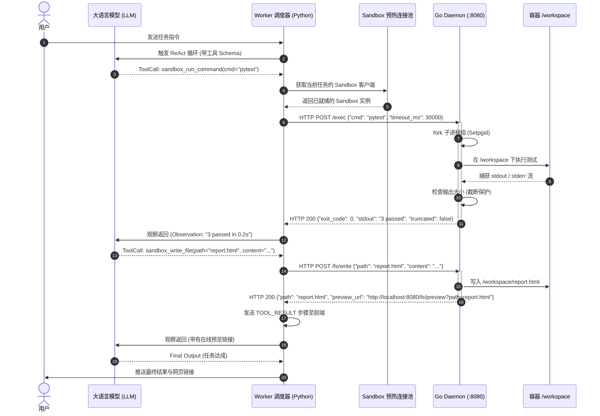

# 01. Sandbox 隔离沙箱核心机制与通信时序设计

## 一、 核心定位与架构概览

Sandbox 是整个 Agent 系统的**物理执行隔离层**，旨在为 LLM 执行任意代码、Shell 命令、文件读写提供安全、独立的宿主容器环境。

```
                                      【宿主机网络】
┌─────────────────────────┐               HTTP / JSON (Token 鉴权)
│   Worker (Python/Agent) │ ──────────────────────────────────────┐
│  - SandboxClient        │                                       │
│  - SandboxPoolManager   │                                       │
└─────────────────────────┘                                       │
                                                                  ▼
┌────────────────────────────────────────────────────────────────────────┐
│                        Docker 沙箱容器 (Linux / Go)                      │
│                                                                        │
│   ┌──────────────────────────────────────────────────────────────┐     │
│   │               Go Daemon (HTTP 服务 :8080)                    │     │
│   │  - /exec (非阻塞命令执行、超时熔断、缓冲区防打爆)             │     │
│   │  - /fs/read, /fs/write, /fs/preview (隔离文件读写与下载)     │     │
│   │  - ProcessManager (PID 追踪、进程树强杀、资源限制)           │     │
│   └──────────────────────────────┬───────────────────────────────┘     │
│                                  │ fork / exec                         │
│                                  ▼                                     │
│   ┌──────────────────────────────────────────────────────────────┐     │
│   │                 /workspace 独立工作空间目录                   │     │
│   │  - 项目源码、测试产物、编译临时文件、产出的静态网页等       │     │
│   └──────────────────────────────────────────────────────────────┘     │
└────────────────────────────────────────────────────────────────────────┘
```

---

## 二、 核心机制设计

### 1. 进程生命周期与强杀机制 (ProcessManager)
* **执行隔离**：Go Daemon 为每个执行命令分配唯一 `ExecutionID`，使用 `os/exec` 创建子进程并设置独立进程组（`Setpgid: true`）。
* **超时熔断**：支持 `timeout_ms` 参数（默认 60s），超时后向整组发送 `SIGKILL`，防止死循环、僵尸进程与交互式阻塞。
* **安全沙箱环境**：默认禁用交互式终端（`stdin: /dev/null`），拦截 `sudo` / 破坏性危险系统调用。

### 2. 输出截断与防爆缓冲区 (Output Truncation)
* LLM 执行 `find /` 或大型日志输出时，极易将数万行字符串返回并塞爆 LLM 上下文。
* Go Daemon 限制最大输出为 `max_output_bytes`（默认 32KB），超出部分保留前 `N` 行与后 `M` 行，并插入 `... [Output Truncated by Sandbox: X bytes omitted] ...` 标记。

### 3. 工作区文件安全读写与外链预览 (Virtual Filesystem)
* **相对路径校验**：严格限制在 `/workspace` 目录下，禁止 `../` 逃逸。
* **按行切片读取**：支持 `start_line` 与 `end_line` 切片，便于 Agent 精准阅读大代码文件。
* **静态资源自动预览**：写入 `.html`, `.svg`, `.png` 等文件时，自动返回 `http://localhost:8080/fs/preview?path=...` 在线链接，前端可直接通过 iframe 或在新标签页渲染展示。

---

## 三、 Worker 与 Sandbox 通信时序图


