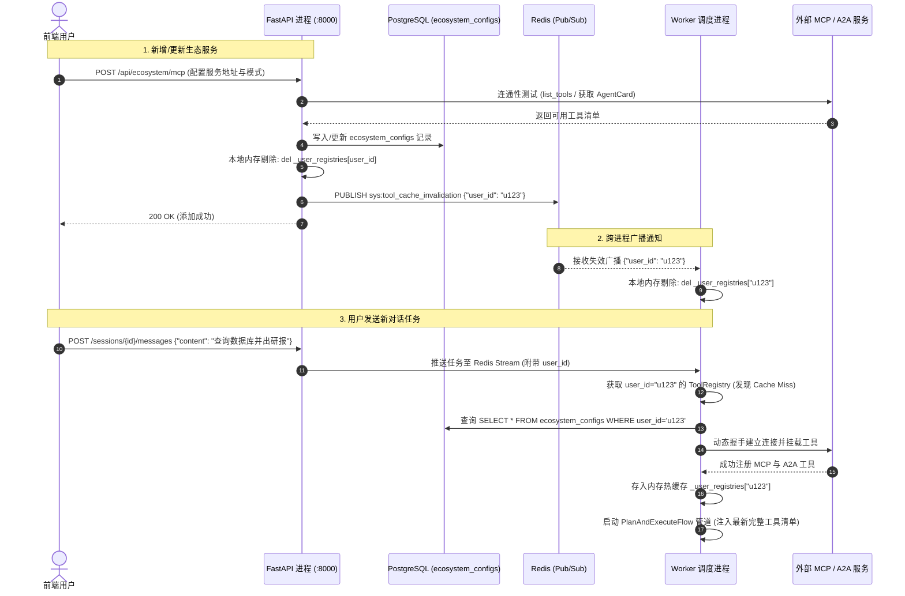

# 02. MCP 与 A2A 工具生态架构及跨进程同步刷新设计

## 一、 背景与架构痛点

系统支持两大外部扩展生态：
1. **Model Context Protocol (MCP)**：支持 `stdio`（子进程）、`sse`（Server-Sent Events）和 `streamable_http`（标准化 HTTP 流）。
2. **Google Agent-to-Agent (A2A)**：采用官方 `a2a-sdk`，通过 `/.well-known/agent-card.json` 发现外部专家并建立通信。

### 痛点挑战（多进程内存隔离）
`api_server`（FastAPI）与 `worker`（任务调度执行进程）为**两个独立的操作系统进程**。
当用户在前端添加或修改 MCP/A2A 服务时，配置写入了 PostgreSQL 数据库；如果仅清除 API 进程的本地内存缓存，Worker 进程持有的内存字典仍为旧工具列表，导致新任务无法感知新工具。

---

## 二、 核心解决方案：Redis 广播失效 + 零 DB 热缓存

```
                    ┌─────────────────────────┐
                    │ 前端 Web 页面增删改配置   │
                    └────────────┬────────────┘
                                 │ 1. HTTP POST /api/ecosystem/...
                                 ▼
                     ┌───────────────────────┐
                     │     FastAPI 进程      │
                     │  - 写入 PostgreSQL     │
                     │  - 清除 API 本地内存    │
                     └───────────┬───────────┘
                                 │ 2. broadcast_invalidation(user_id)
                                 ▼
              ┌─────────────────────────────────────┐
              │  Redis Pub/Sub 广播通道              │
              │  channel: sys:tool_cache_invalidation│
              └─────────┬─────────────────┬─────────┘
                        │                 │
             3. 广播通知 │                 │ 3. 广播通知
                        ▼                 ▼
          ┌─────────────────────┐   ┌─────────────────────┐
          │   所有 Worker 进程   │   │  其他 API 实例进程   │
          │ 剔除本地字典该用户 Key  │   │ 剔除本地字典该用户 Key │
          └──────────┬──────────┘   └─────────────────────┘
                     │ 4. 下次执行任务时触发冷启动
                     ▼
          ┌─────────────────────┐
          │ 从 DB 读取最新配置    │
          │ 重新挂载 MCP / A2A  │
          └─────────────────────┘
```

### 关键设计收益
* **常规执行零 DB 消耗（0ms 纯内存命中）**：在未变更配置时，Worker 与 API 直接从本地内存字典返回 `ToolRegistry`，避免在 Agent 每次循环思考时查询数据库。
* **变更时毫秒级全局同步**：配置变更时通过 Redis Pub/Sub 在 5ms 内通知所有 Worker 进程将该用户缓存置为失效。

---

## 三、 同步刷新与执行时序图


