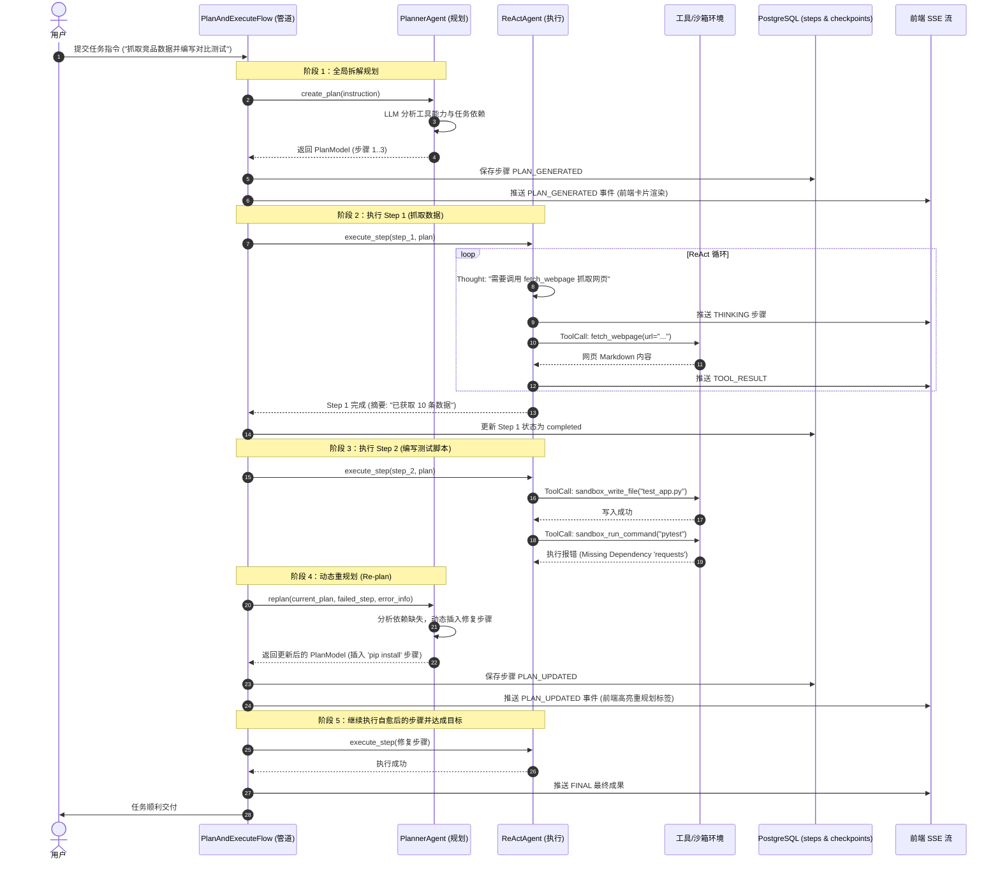

# 03. Planner 宏观规划与 ReAct 执行机制及通信时序

## 一、 双层智能体范式 (Plan-and-Execute Paradigm)

为解决传统单一 ReAct Agent 在复杂长任务中容易**遗忘目标、发散迷航、缺乏宏观大局观**的问题，系统采用 **Planner（独立规划 Agent）+ ReAct（执行 Agent）双层协作架构**：

```
                              ┌────────────────────────┐
                              │  用户复杂指令 / 目标     │
                              └───────────┬────────────┘
                                          │
                                          ▼
                      ┌────────────────────────────────────────┐
                      │             Planner Agent              │
                      │  - 目标全局拆解与依赖分析                │
                      │  - 输出严格结构化 PlanModel (JSON)       │
                      │  - 动态重规划 (Re-planning / 故障自愈)   │
                      └───────────────────┬────────────────────┘
                                          │ 生成 PlanStep 1..N
                                          ▼
                      ┌────────────────────────────────────────┐
                      │             ReAct Agent                │
                      │  - 专注当前单个子步骤的执行与工具调用      │
                      │  - 思考(Thought) ➔ 动作(Action) ➔       │
                      │    观察(Observation) 循环              │
                      │  - 产出子步骤摘要 Summary                │
                      └───────────────────┬────────────────────┘
                                          │
                        ┌─────────────────┴─────────────────┐
                        ▼                                   ▼
             【子步骤成功完成】                      【子步骤受阻或失败】
                        │                                   │
                        ▼                                   ▼
              推进至下一个 Step                    触发 Planner 动态 Re-plan
```

---

## 二、 核心组件与流转机制

### 1. PlannerAgent
* **结构化输入与输出**：渲染 `system/planner.md`，基于当前可用工具（内置工具 + MCP + A2A）输出 `PlanModel`，包含 `goal`、`steps: [PlanStepModel]`。
* **动态重规划 (Re-planning)**：当 ReAct 执行遭遇重大环境变化或工具报错，Planner 基于已完成步骤摘要和当前失败原因重新计算后续步骤。

### 2. ReActAgent
* **聚焦当前单一上下文**：系统提示词只注入当前待执行的步骤描述与目标，避免长任务中整个任务的历史冗余污染上下文。
* **工具执行与观察**：调用 `sandbox_*` 或 `mcp_*` 工具，将工具返回包装为 `TOOL_RESULT` 并持久化到 `task_steps`。

### 3. Checkpoint 与断点续传
* 每个步骤执行前后更新 Checkpoint `version`，支持任务中断后从 `last_step_index` 平滑恢复。

---

## 三、 Planner 与 ReAct 协作通信时序图


