# 04. Sandbox CDP 浏览器工具设计与 DDD 架构规范

## 一、 核心定位与背景

在自动化与 AI Agent 场景中，许多现代 Web 页面由 React、Vue 等前端框架构建，大量可点击交互按钮并非传统的 `<button>` 或 `<a>`，而是带有点击事件或手型指针的 `<div>`、`<span>`。
如果直接向 LLM 投喂原始 HTML，会导致巨额 Token 浪费且干扰严重；若仅检索标准标签，则会遗漏大量关键按钮。

本设计基于 **Go + `go-rod/rod` + Chrome DevTools Protocol (CDP)**，在 Sandbox 内部构建一个轻量、高效的浏览器自动化 Tool 集群。通过 **JS 探针启发式识别 + 自动编号打标 + 语义上下文快照**，向 LLM 暴露一组清晰的高层语义工具，实现“打开、感知、点击、截图、关闭”的完整闭环。

---

## 二、 整体架构拓扑与分层职责

```
┌────────────────────────────────────────────────────────────────────────┐
│                        宿主机 / Python API Server                      │
│   - Tool Registry (注册 5 大浏览器工具)                                   │
│   - ReAct Agent 循环 (调度决策)                                         │
└───────────────────────────────────┬────────────────────────────────────┘
                                    │ HTTP / MCP Tool Calling
                                    ▼
┌────────────────────────────────────────────────────────────────────────┐
│                        Docker 沙箱容器 (Linux / Go)                      │
│                                                                        │
│   ┌──────────────────────────────────────────────────────────────┐     │
│   │                 Go Sandbox Daemon (DDD 架构)                 │     │
│   │                                                              │     │
│   │  [Interface Layer]                                           │     │
│   │    - HTTP / MCP Tool Handler (5 大原子工具入口)               │     │
│   │                                                              │     │
│   │  [Application Layer]                                         │     │
│   │    - OpenPage / Click / GetSnapshot / Screenshot / Close     │     │
│   │                                                              │     │
│   │  [Domain Layer (核心业务与抽象)]                               │     │
│   │    - Aggregate: BrowserSession                               │     │
│   │    - Entities & VOs: PageSnapshot, InteractiveElement        │     │
│   │    - Output Port: CDPDriverPort (解耦驱动)                   │     │
│   │                                                              │     │
│   │  [Infrastructure Layer (技术实现)]                           │     │
│   │    - RodCDPDriver (基于 go-rod 实现 CDPDriverPort)           │     │
│   │    - JSProbeEngine (启发式扫描、div识别、打标 data-agent-id)   │     │
│   └──────────────────────────────┬───────────────────────────────┘     │
│                                  │ 本地回环 WebSocket (127.0.0.1:9222)   │
│                                  ▼                                     │
│   ┌──────────────────────────────────────────────────────────────┐     │
│   │                 Chromium 浏览器 (Headless 模式)               │     │
│   │  - 开启 CDP: --remote-debugging-port=9222                    │     │
│   │  - 共享内存优化: --disable-dev-shm-usage                      │     │
│   └──────────────────────────────────────────────────────────────┘     │
└────────────────────────────────────────────────────────────────────────┘
```

---

## 三、 DDD 领域架构设计 (严格边界划分)

### 1. 领域层 (Domain Layer) - 纯业务逻辑，零外部框架依赖

领域层负责定义浏览器的业务状态模型、实体、值对象及输出端口（Port），**严禁依赖 `go-rod` 或任何 CDP 库**。

```go
package domain

import (
	"context"
	"time"
)

// ElementID 探针分配给元素的数字编号（用于 LLM 引用）
type ElementID int

// InteractiveElement 代表页面上识别出的一个可交互元素（值对象/实体）
type InteractiveElement struct {
	ID          ElementID `json:"id"`
	TagName     string    `json:"tag_name"`     // DIV, BUTTON, INPUT, A
	Text        string    `json:"text"`         // 按钮名/文本
	Role        string    `json:"role"`         // button, link, checkbox 等
	ContextText string    `json:"context_text"` // 向上提取的卡片/列表容器上下文
	Placeholder string    `json:"placeholder"`
	Value       string    `json:"value"`
	IsDisabled  bool      `json:"is_disabled"`
}

// PageSnapshot 某一时刻页面的完整感知快照（不可变值对象）
type PageSnapshot struct {
	URL         string               `json:"url"`
	Title       string               `json:"title"`
	Elements    []InteractiveElement `json:"elements"`
	Screenshot  []byte               `json:"screenshot,omitempty"`
	CapturedAt  time.Time            `json:"captured_at"`
}

// FormatForLLM 组装输出为 LLM 最易读的结构化 Markdown 树
func (s *PageSnapshot) FormatForLLM() string {
    // 转化为带层级编号的精简 Prompt 结构
}

// CDPDriverPort 输出端口定义（驱动抽象，依赖倒置）
type CDPDriverPort interface {
	Navigate(ctx context.Context, url string) error
	Close(ctx context.Context) error
	InspectPage(ctx context.Context, withScreenshot bool) (*PageSnapshot, error)
	ClickByAgentID(ctx context.Context, agentID int) error
	CaptureScreenshot(ctx context.Context, fullPage bool) ([]byte, error)
	WaitStable(ctx context.Context) error
}

// BrowserSession 聚合根（管理会话生命周期、操作流转与快照状态）
type BrowserSession struct {
	id           string
	driver       CDPDriverPort
	isOpen       bool
	lastSnapshot *PageSnapshot
}
```

### 2. 基础设施层 (Infrastructure Layer) - 技术具体实现

负责具体 CDP 驱动（`go-rod`）、JS 探针脚本注入与沙箱系统调用。

* **`RodCDPDriver`**：实现 `domain.CDPDriverPort`，通过 `127.0.0.1:9222` WebSocket 与 Chromium 通信。
* **`JSProbeEngine`（启发式探针算法）**：
  1. 遍历页面可见 DOM 节点，过滤 `display: none` / `opacity: 0` / 视口外元素。
  2. 判定可点击 `div`：结合 `cursor: pointer`、`role="button"`、`onclick` 及 ARIA 属性。
  3. 向上检索最近容器卡片（`closest('li, article, .card')`）提取上下文标题。
  4. 动态打上 `data-agent-id="X"` 并返回精简数组。

### 3. 应用层 (Application Layer) - 用例编排

协调领域聚合根与基础设施，处理事务/超时，并为接口层提供用例方法：
- `OpenPageUseCase(ctx, url)`
- `ClosePageUseCase(ctx)`
- `GetSnapshotUseCase(ctx, includeScreenshot)`
- `ClickElementUseCase(ctx, elementID)`
- `CaptureScreenshotUseCase(ctx, fullPage)`

### 4. 接口层 (Interface Layer) - 外部协议暴露

暴露符合 **OpenAI Function Calling / MCP 标准** 的 5 个 Tool 接口。

---

## 四、 5 大核心 Tool 规范 (Tool Specification)

| Tool 名称 | 核心职责 | 入参 (Schema) | 出参 (Observation) |
|---|---|---|---|
| **`browser_open_page`** | 打开指定 URL 网址并加载页面 | `url`: string (必填)<br>`timeout_sec`: int (可选) | 页面标题、URL 以及**初次已编号页面结构快照** |
| **`browser_close_page`** | 关闭当前页面并释放标签页资源 | *(无)* | 释放成功确认文本 |
| **`browser_get_snapshot`** | 主动刷新提取当前视口已编号结构 (滚动/异步加载后) | `include_screenshot`: bool (可选) | 最新已编号的元素树结构文本 |
| **`browser_click`** | 根据快照编号精准触发物理点击 | `element_id`: int (必填) | 点击状态 + **自动回传点击后的最新页面快照** |
| **`browser_screenshot`** | 截取当前视口或全页面图像 | `full_page`: bool (可选) | Base64 图片数据及元信息 |

---

## 五、 通信与执行时序图 (ReAct 闭环)

```mermaid
sequenceDiagram
    autonumber
    actor LLM as ReAct Agent (LLM)
    participant App as Application Service
    participant Domain as BrowserSession (Domain)
    participant Rod as RodCDPDriver (Infra)
    participant Chrome as Chromium CDP (127.0.0.1:9222)

    Note over LLM,Chrome: 1. 打开页面阶段
    LLM->>App: 调用 browser_open_page(url="https://example.com")
    App->>Domain: session.OpenPage(ctx, url)
    Domain->>Rod: driver.Navigate(ctx, url)
    Rod->>Chrome: Page.navigate
    Domain->>Rod: driver.InspectPage(ctx)
    Rod->>Chrome: Runtime.evaluate (注入 JS 探针打标)
    Chrome-->>Rod: 返回提取的交互元素列表
    Rod-->>Domain: 构建 PageSnapshot
    Domain-->>App: 返回 PageSnapshot
    App-->>LLM: [Observation] 包含 [1] <input>、[2] (div-button) "搜索" 的已编号结构

    Note over LLM,Chrome: 2. 决策与点击阶段
    LLM->>App: 调用 browser_click(element_id=2)
    App->>Domain: session.Click(ctx, elementID=2)
    Domain->>Rod: driver.ClickByAgentID(ctx, 2)
    Rod->>Chrome: DOM.querySelector('[data-agent-id="2"]') -> Input.dispatchMouseEvent
    Domain->>Rod: driver.WaitStable(ctx) (智能等待网络空闲/DOM防抖)
    Domain->>Rod: driver.InspectPage(ctx) (重新感知打标)
    Rod->>Chrome: Runtime.evaluate (注入新一轮探针)
    Chrome-->>Domain: 构建最新 PageSnapshot
    Domain-->>App: 返回新快照
    App-->>LLM: [Observation] 点击成功！附带点击后的最新页面结构快照

    Note over LLM,Chrome: 3. 截图与收尾
    LLM->>App: 调用 browser_screenshot(full_page=false)
    App->>Domain: session.Screenshot(ctx, false)
    Domain->>Rod: driver.CaptureScreenshot(ctx)
    Rod-->>LLM: [Observation] 返回 Base64 截图
    LLM->>App: 调用 browser_close_page()
    App->>Domain: session.ClosePage(ctx)
    Domain-->>LLM: [Observation] 页面已关闭
```



---

## 六、 研发任务优先级划分 (P0 ~ P3)

### 🔴 P0 级：核心骨架与最小可行性验证 (Must-have)
- [x] **P0-1 沙箱环境与 Chromium 基础容器构建**
  - 编写沙箱 Dockerfile，安装 Chromium、中文字体库（`fonts-noto-cjk`）及图形依赖。
  - 配置 `--remote-debugging-port=9222`、`--disable-dev-shm-usage`，跑通本地 WebSocket 连接。
- [x] **P0-2 JS 启发式探针打标算法研发**
  - 编写 JS 脚本：识别 `div` 按钮、`cursor: pointer`、ARIA 角色、可视区域过滤。
  - 提取父级上下文（解决同名按钮歧义），动态给 DOM 注入 `data-agent-id` 并返回结构化 JSON。
- [x] **P0-3 Go-rod 基础驱动层跑通**
  - 使用 `go-rod` 连接本地 CDP，验证：执行 JS 探针 ➔ 提取元素切片 ➔ 按 `data-agent-id` 触发真实点击。

### 🟠 P1 级：5 大核心 Tool 与 DDD 业务闭环 (Core Features)
- [x] **P1-1 DDD 领域层骨架搭建**
  - 严格隔离 `domain`（聚合根 `BrowserSession`、`PageSnapshot`、`CDPDriverPort`）与 `infrastructure`。
- [x] **P1-2 实现 5 大标准 Tool 用例**
  - 完成 `browser_open_page`, `browser_get_snapshot`, `browser_click`, `browser_screenshot`, `browser_close_page`。
- [x] **P1-3 接口层适配（MCP / HTTP REST）**
  - 编写符合 OpenAI Function Calling / MCP 规范的 Tool Schema 与 HTTP Handler。

### 🟡 P2 级：Agent 调度联动与稳定性调优 (Integration & Stability)
- [x] **P2-1 API Server / Tool Registry 对接**
  - 在后端 Tool 管理中心注册这 5 个浏览器工具，打通参数传递与结果回传。
- [x] **P2-2 页面智能等待与渲染防抖 (Smart Waiting)**
  - 在 `browser_open_page` 和 `browser_click` 后增加网络空闲（Network Idle）或 DOM 变化等待，防止页面未渲染完成即提取快照。
- [x] **P2-3 端到端 ReAct 真实场景联调**
  - 针对典型用例（搜索关键字 ➔ 识别列表 ➔ 点击结果 ➔ 截图确认）进行 Prompt 调优与闭环测试。

### 🟢 P3 级：生产级加固与高级特性 (Production Hardening)
- [ ] **P3-1 反爬与环境隐身 (Stealth)**
  - 集成 `rod` 的 stealth 机制，抹除 `navigator.webdriver` 自动化指纹特征。
- [ ] **P3-2 资源泄漏防御与生命周期管理**
  - 会话空闲超时自动关闭（TTL 释放）、崩溃自动重启、容器内存水位监控。
