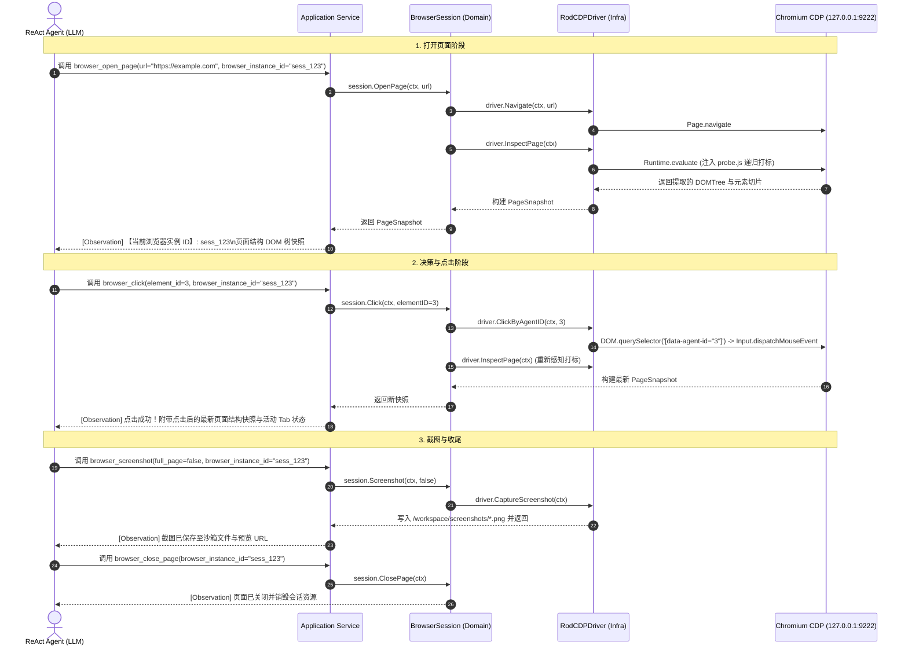

# 04. Sandbox CDP 浏览器工具设计与 DDD 架构规范

## 一、 核心定位与背景

在自动化与 AI Agent 场景中，许多现代 Web 页面由 React、Vue 等前端框架构建，大量可点击交互按钮并非传统的 `<button>` 或 `<a>`，而是带有点击事件或手型指针的 `<div>`、`<span>`。
如果直接向 LLM 投喂原始 HTML，会导致巨额 Token 浪费且干扰严重；若仅检索标准标签，则会遗漏大量关键按钮。

本设计基于 **Go + `go-rod/rod` + Chrome DevTools Protocol (CDP)**，在 Sandbox 内部构建一个轻量、高效的浏览器自动化 Tool 集群。通过 **递归语义 DOM Tree 探针 + 自动编号打标 + 浏览器会话生命周期维护（CDP Session ID）**，向 LLM 暴露一组清晰的高层语义工具，实现“打开、感知、点击、截图、关闭”的完整闭环。

---

## 二、 整体架构拓扑与分层职责

```
┌────────────────────────────────────────────────────────────────────────┐
│                        宿主机 / Python API Server                      │
│   - Tool Registry (注册 5 大浏览器工具)                                   │
│   - Session-level CDP 句柄维护 (browser_instance_id / session_id)      │
│   - ReAct Agent 循环 (调度决策)                                         │
└───────────────────────────────────┬────────────────────────────────────┘
                                    │ HTTP / MCP Tool Calling (携带 session_id)
                                    ▼
┌────────────────────────────────────────────────────────────────────────┐
│                        Docker 沙箱容器 (Linux / Go)                      │
│                                                                        │
│   ┌──────────────────────────────────────────────────────────────┐     │
│   │                 Go Sandbox Daemon (DDD 架构)                 │     │
│   │                                                              │     │
│   │  [Interface Layer]                                           │     │
│   │    - HTTP / MCP Tool Handler (带结构化日志打印)                │     │
│   │                                                              │     │
│   │  [Application Layer]                                         │     │
│   │    - OpenPage / Click / GetSnapshot / Screenshot / Close     │     │
│   │    - 维护多用户/多会话隔离映射 (Session Repository)             │     │
│   │                                                              │     │
│   │  [Domain Layer (核心业务与抽象)]                               │     │
│   │    - Aggregate: BrowserSession                               │     │
│   │    - Entities & VOs: PageSnapshot, InteractiveElement        │     │
│   │    - Output Port: CDPDriverPort (解耦驱动)                   │     │
│   │                                                              │     │
│   │  [Infrastructure Layer (技术实现)]                           │     │
│   │    - RodCDPDriver (基于 go-rod 实现 Incognito 隔离 Context)  │     │
│   │    - JSProbeEngine (递归语义 DOM Tree 探针 + 编号打标)        │     │
│   └──────────────────────────────┬───────────────────────────────┘     │
│                                  │ 本地回环 WebSocket (127.0.0.1:9222)   │
│                                  ▼                                     │
│   ┌──────────────────────────────────────────────────────────────┐     │
│   │                 Chromium 浏览器 (Headless 模式)               │     │
│   │  - 开启 CDP: --remote-debugging-port=9222                    │     │
│   │  - 共享内存优化: --disable-dev-shm-usage                      │     │
│   │  - 独立上下文: 每个 Session 独占 Incognito BrowserContext      │     │
│   └──────────────────────────────────────────────────────────────┘     │
└────────────────────────────────────────────────────────────────────────┘
```

---

## 三、 核心机制演进与架构规范

### 1. CDP 浏览器会话生命周期与 Session ID 维护

为了支持**多用户并发隔离**以及**同一个聊天会话中的多轮指令连续操作**（例如第一轮打开主页，第二轮用户输入“继续截图”）：

- **会话级绑定（Session-level Binding）**：
  - 沙箱通过 `session_id` 为每个会话创建独立的 **Incognito BrowserContext** 与标签页，确保 Cookie、LocalStorage 与页面状态完全隔离。
  - **寻址优先级（Dual-Track Resolution）**：
    1. 工具入参中显式指定的 `browser_instance_id`
    2. 当前任务上下文绑定的会话 ID `ctx["session_id"]`
    3. 任务 ID `ctx["task_id"]`
    4. 默认兜底 `"default"`
  - `browser_open_page` 成功打开网页后，快照顶部显式输出：`【当前浏览器实例 ID】: session_xxx`，供 LLM 在后续多步操作中精确识别。
- **生命周期策略**：
  - 严禁在单个 Task 的 `finally` 中销毁浏览器，浏览器实例与用户会话生命周期对齐，仅在 Agent 调用 `browser_close_page` 或会话销毁时释放。

### 2. 递归语义 DOM Tree 探针机制 (`probe.js`)

不再简单输出扁平列表，而是递归生成层级清晰的语义 DOM 树快照：
- 提取包含 `[HEADER]`, `[NAV]`, `[MAIN]`, `(H1)`~`(H6)`, `(P)`, `[Card]` 的树状缩进快照。
- **父子控件解耦**：若大容器内包含独立的子链接/按钮，大容器仅作为结构层级展示，内部所有子交互元素均独立分配唯一的 `[1]`, `[2]` 编号。
- 自动滤除非语义节点（SVG、`<script>`、`<style>`、视口外不可见元素）。

### 3. 轻量化直通与日志体系

- **轻量化导航**：`Navigate` 仅保留原生的 `WaitLoad()`，移除多余的重试与长时间轮询，打开网页 + 生成快照整体耗时控制在 **700ms 左右**，截图耗时 **50ms 左右**。
- **全链路结构化日志**：沙箱服务端对每个工具请求的参数、耗时、标题、Tab 数量等统一输出 `[Sandbox][Browser]` 日志，方便可观测性排查。

---

## 四、 DDD 领域架构设计

### 1. 领域层 (Domain Layer) - 纯业务逻辑，零外部框架依赖

```go
package domain

import (
	"context"
	"time"
)

// ElementID 探针分配给元素的数字编号（用于 LLM 引用）
type ElementID int

// InteractiveElement 代表页面上识别出的一个可交互元素（值对象/实体）
type InteractiveElement struct {
	ID          ElementID `json:"id"`
	TagName     string    `json:"tag_name"`     // DIV, BUTTON, INPUT, A
	Text        string    `json:"text"`         // 按钮名/文本
	Role        string    `json:"role"`         // button, link, checkbox 等
	ContextText string    `json:"context_text"` // 向上提取的卡片/列表容器上下文
	Placeholder string    `json:"placeholder"`
	Value       string    `json:"value"`
	IsDisabled  bool      `json:"is_disabled"`
}

// PageSnapshot 某一时刻页面的完整感知快照（不可变值对象）
type PageSnapshot struct {
	URL         string               `json:"url"`
	Title       string               `json:"title"`
	ActiveTabID string               `json:"active_tab_id"`
	TotalTabs   int                  `json:"total_tabs"`
	DOMTree     string               `json:"dom_tree"` // 递归语义 DOM 树结构
	Elements    []InteractiveElement `json:"elements"`
	Screenshot  []byte               `json:"screenshot,omitempty"`
	CapturedAt  time.Time            `json:"captured_at"`
}

// FormatForLLM 组装输出为 LLM 最易读的结构化 Markdown 树
func (s *PageSnapshot) FormatForLLM() string {
	// 优先输出层次清晰的 DOMTree 文本
}

// CDPDriverPort 输出端口定义（驱动抽象，依赖倒置）
type CDPDriverPort interface {
	Navigate(ctx context.Context, url string) error
	Close(ctx context.Context) error
	InspectPage(ctx context.Context, withScreenshot bool) (*PageSnapshot, error)
	ClickByAgentID(ctx context.Context, agentID int) error
	CaptureScreenshot(ctx context.Context, fullPage bool) ([]byte, error)
	WaitStable(ctx context.Context) error
}

// BrowserSession 聚合根（管理会话生命周期、操作流转与快照状态）
type BrowserSession struct {
	id           string
	driver       CDPDriverPort
	isOpen       bool
	lastSnapshot *PageSnapshot
}
```

### 2. 基础设施层 (Infrastructure Layer)

- **`RodCDPDriver`**：封装 `go-rod` 的 `Incognito BrowserContext` 与 Page 操作，实现 `domain.CDPDriverPort`。
- **`MemorySessionRepository`**：纯内存并发安全的会话仓库（`sync.Map`），根据 `session_id` 维护隔离的聚合根生命周期。

---

## 五、 5 大核心 Tool 规范 (Tool Specification)

| Tool 名称 | 核心职责 | 入参 (Schema) | 出参 (Observation) |
|---|---|---|---|
| **`browser_open_page`** | 打开指定 URL 网址并加载页面 | `url`: string (必填)<br>`timeout_sec`: int (可选)<br>`browser_instance_id`: string (可选) | 包含 `【当前浏览器实例 ID】`、页面标题、活动 Tab 状态与**语义 DOM 树结构快照** |
| **`browser_close_page`** | 关闭沙箱浏览器页面并销毁会话资源 | `browser_instance_id`: string (可选) | 释放成功确认文本 |
| **`browser_get_snapshot`** | 主动刷新提取当前视口已编号结构 (滚动/异步加载后) | `include_screenshot`: bool (可选)<br>`browser_instance_id`: string (可选) | 最新已编号的语义 DOM 树结构文本与元信息 |
| **`browser_click`** | 根据快照编号精准触发物理点击（支持容错强转） | `element_id`: int (必填)<br>`browser_instance_id`: string (可选) | 点击状态 + **自动回传点击后的最新已编号页面快照与活动 Tab** |
| **`browser_screenshot`** | 截取当前视口或全页面图像并落地沙箱文件 | `full_page`: bool (可选)<br>`save_path`: string (可选)<br>`browser_instance_id`: string (可选) | 沙箱文件相对路径、HTTP 预览 URL 与 Base64 数据 |

---

## 六、 通信与执行时序图 (ReAct 闭环)


