# 05. 任务中断控制、Worker 恢复机制与熔断配置规范

## 一、 背景与核心问题分析

在分布式 Agent 任务执行体系中，由于涉及 **Web API 进程、Redis 队列/PubSub、PostgreSQL 数据库、Worker 执行器** 多个异步组件，存在如下典型的高并发与一致性难题：

1. **用户主动取消任务后，重启 Worker 仍旧继续执行**：
   - *旧有缺陷*：API 进程调用 `/cancel` 将数据库任务置为 `CANCELLED`，但 Worker 进程因 SQLAlchemy 内存一级缓存（Identity Map）未能感知该变更；Worker 执行完毕或被中断退出时，其 `finally` 逻辑执行 `update_status(COMPLETED / PAUSED)` 反向覆盖了 `CANCELLED` 状态。
   - *恢复死循环*：Worker 再次启动时，启动恢复扫描（`recover_paused_tasks`）发现数据库中存在被误改回的 `PAUSED` 任务，将其重新入队执行。
2. **会话死锁（`Session xxx already has a running task`）**：
   - 当 Worker 进程异常退出、崩溃或未正常结束任务时，数据库中遗留了心跳停止的 `RUNNING` 僵尸任务或 `PAUSED` 任务。用户后续在同一会话中发送新消息时被 409 互斥检查永久拦截。
3. **多步执行流被提前误判熔断**：
   - 旧代码误将面向前端推送的流式 UI 事件序列号（`step_index`）当成了任务计划执行循环上限（硬编码 `step_index >= 20`），导致多步骤任务在第 2 步后被误杀。
4. **多轮对话输入“继续”无法衔接上下文**：
   - Worker 启动新任务时未拉取最近交互历史，导致 Planner 无法理解用户的代词与连续意图。

---

## 二、 核心架构与一致性控制方案

```mermaid
graph TD
    subgraph 1. API 端主动取消
        User[用户点击取消] -->|POST /tasks/:id/cancel| CancelUC[CancelTaskUseCase]
        CancelUC -->|1. 更新 DB 终态| DB[(PostgreSQL: status=CANCELLED)]
        CancelUC -->|2. 写入毫秒级 Redis 标记| RedisKey["Redis Key: task:cancelled:{id} (TTL 24h)"]
        CancelUC -->|3. 发布取消事件| PubSub[Redis PubSub: task_cancelled]
    end

    subgraph 2. Worker 运行时三道防线拦截
        WLoop[Worker 步骤循环] -->|步骤执行前校验| Ck1{"Redis 存在 task:cancelled 标记?"}
        Ck1 -->|是| Exit1[立即 ACK 消息并直接退出]
        Ck1 -->|否| Expire[db.expire_all 穿透缓存]
        Expire --> Ck2{"DB 状态为 CANCELLED?"}
        Ck2 -->|是| Exit2[立即退出，严禁写入 PAUSED/COMPLETED]
        Ck2 -->|否| Step[执行当前 Plan 步骤]
        Step --> Ck3{"任务完成前再次校验"}
        Ck3 -->|已取消| SkipSave[跳过状态更新，安全退出]
        Ck3 -->|正常| MarkDone[写入 COMPLETED]
    end

    subgraph 3. Worker 重启与恢复防死循环
        Boot[Worker 启动 / 定时巡检] --> RecScan[recover_paused_tasks / recover_zombie_tasks]
        RecScan --> Filter{"检查 Redis task:cancelled 标记"}
        Filter -->|已被用户取消| Ignore[跳过恢复，绝不重新入队]
        Filter -->|正常暂停| Enqueue[重新投递 Redis 队列恢复执行]
    end
```



---

## 三、 详细技术方案设计

### 1. Redis 毫秒级取消信号（`task:cancelled:{task_id}`）

为了彻底解决跨进程缓存与数据库隔离延迟，引入分布式无锁取消标记：
- **写入时机**：用户在 API 端调用 `CancelTaskUseCase.execute` 时，除更新 DB 外，立即执行：
  ```python
  await redis.set(f"task:cancelled:{task_id}", "1", ex=86400)
  ```
- **读取拦截点**：
  1. **任务入队处理前**：`process_task` 启动前校验，若已取消直接 `queue.ack(msg_id)` 并返回。
  2. **每个子步骤执行前**：执行 `async for step in executor.run():` 每次循环前校验。
  3. **任务收尾前**：防止大模型执行完最后一步时将 `CANCELLED` 误覆盖为 `COMPLETED`。
  4. **优雅退出前**：Worker 收到退出信号时，若任务已被取消，绝不执行 `update_status(task_id, "PAUSED")`。

### 2. 会话并发死锁自愈机制（Self-Healing Concurrency）

在 `SendMessageUseCase` 处理用户发送新消息时，增加了全自动自愈逻辑，消除人工修复数据库的负担：

```python
# 3. 检查单会话并发互斥与自动自愈遗留任务
running_task = await self.task_repo.get_active_in_session(session_id)
if running_task and not running_task.is_terminal:
    is_cancelled = await redis.exists(f"task:cancelled:{running_task.id}")
    is_zombie_or_paused = False
    
    if running_task.status == "PAUSED":
        is_zombie_or_paused = True
    elif running_task.status == "RUNNING":
        # 心跳超时（> 60秒无上报，说明执行该任务的 Worker 已经异常崩溃或失联）
        if not running_task.worker_heartbeat or (now - running_task.worker_heartbeat).total_seconds() > 60:
            is_zombie_or_paused = True

    if is_cancelled or is_zombie_or_paused:
        # 自动终结遗留的废弃任务，释放会话锁
        await self.task_repo.update_status(
            running_task.id,
            status="CANCELLED",
            error="Cancelled or superseded by new message",
            completed_at=now,
        )
        running_task = None

TaskSchedulerService.validate_session_concurrency(session_id, running_task)
```

---

## 四、 熔断配置与死循环防护体系

### 1. 环境变量配置项（`.env` 规范）

将所有熔断与重试阈值收敛至全局配置 `backend/src/config/settings.py`，支持生产环境动态调整：

| 配置项 | 默认值 | 说明 |
|---|---|---|
| `AGENT_FLOW_MAX_STEPS` | `100` | 单个 Agent 任务全局最大事件/步骤总数（防止失控无限生成） |
| `AGENT_FLOW_MAX_REPLANS` | `3` | Planner Agent 最大动态重规划次数上限 |
| `WORKER_HEARTBEAT_TIMEOUT` | `60` | Worker 心跳超时判定阈值（秒），超过此时间判定为僵尸任务 |
| `WORKER_CONCURRENCY` | `2` | 单个 Worker 进程内并发消费协程数量 |

### 2. 多重防死循环拦截机制（Action Fingerprinting）

在 `BaseAgent` 调度循环中内嵌指纹检测：
- **动作指纹**：`MD5(tool_name + sorted_json_args)`。
- **2 次相同参数调用**：判定为死循环陷阱，立即熔断当前子计划并触发动态 Re-Plan 重规划。
- **3 次相同参数调用**：系统向 LLM 注入强警告信息，强制更换攻坚策略。

---

## 五、 多轮对话历史上下文滑窗（10条消息）

### 1. 上下文提取与清洗
在 `executor.py` 中，当任务关联了 `session_id` 时：
1. 自动从数据库拉取最近 15 条历史消息；
2. 过滤掉当前任务对应的触发消息以及状态为 `streaming` 的空占位消息；
3. 提取最近 10 条真实的用户输入（`role: user`）与 Agent 最终答复（`role: assistant`），组装成 `history_messages`。

### 2. 双层注入协同
- **Planner Agent**：Prompt 顶部注入 `<chat_history>`。当用户输入“继续”或“截取刚才页面的图”时，Planner 结合上轮对话中的目标和已执行结果，精确规划下一步任务。
- **ReAct Agent**：在系统 System Prompt 中挂载历史记忆，保证多模态与工具调用的连贯性。

---

