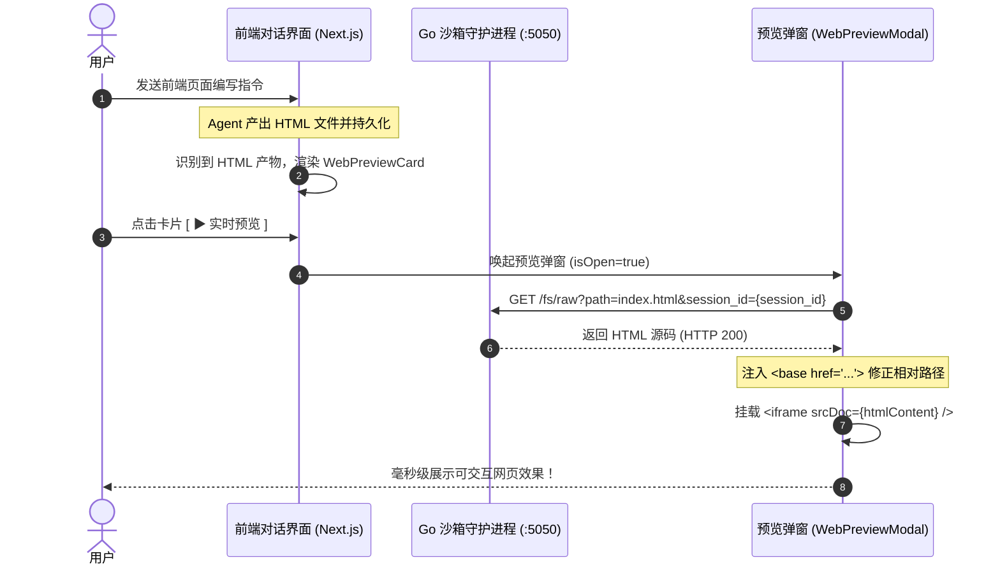
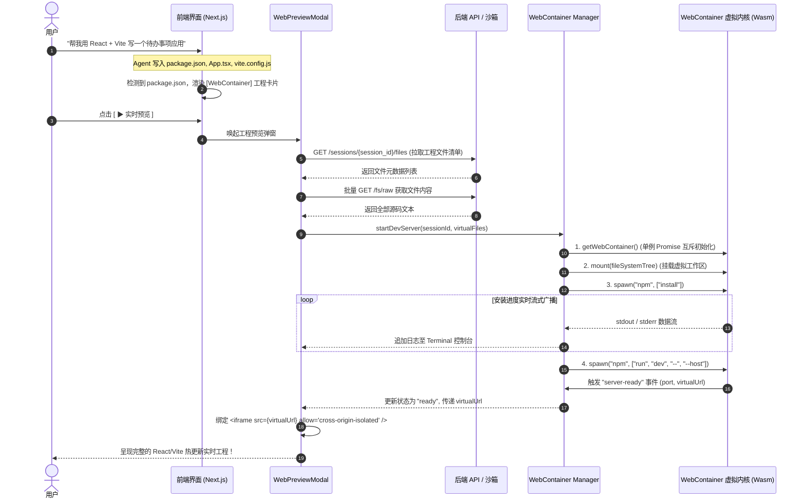
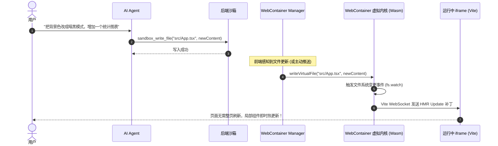
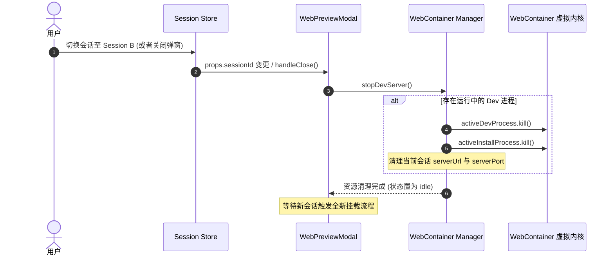

# 06. Web 实时预览与 WebContainer 动态工程化设计规范

本文档详细阐述系统中的 **Web 页面实时预览** 与 **WebContainer 客户端动态工程化运行体系** 的核心机制处理、时序逻辑与异常边界防御。

---

## 一、 系统架构与双模调度全景 (Architecture Overview)

系统为前端 Web 应用提供了**零服务器算力消耗、毫秒级响应、高度安全隔离**的智能化双模运行体系：

```
                                  【用户指令触发】
                                         │
                                         ▼
                             ┌───────────────────────┐
                             │  LLM Agent 代码生成   │
                             │ (sandbox_write_file)  │
                             └───────────┬───────────┘
                                         │ 写入沙箱文件
                                         ▼
                     ┌───────────────────────────────────────┐
                     │ Go Sandbox (Docker :5050)             │
                     │ /workspace/sessions/{session_id}/...  │
                     └───────────────────┬───────────────────┘
                                         │ 前端拉取识别
                                         ▼
                     ┌───────────────────────────────────────┐
                     │ 前端智能分流决策 (Smart Dispatch)     │
                     └───────┬───────────────────────┬───────┘
                             │ 无 package.json       │ 包含 package.json
                             │ (纯 HTML/CSS/JS)      │ (React/Vite/Vue 工程)
                             ▼                       ▼
            ┌─────────────────────────────┐ ┌─────────────────────────────┐
            │ 【模式 A: 纯 H5 极速预览】  │ │【模式 B: WebContainer 引擎】│
            │ • 沙箱拉取 HTML 文本        │ │ • 浏览器启动 Wasm 虚拟 Node │
            │ • 注入 <base href="...">    │ │ • 虚拟文件系统挂载          │
            │ • iframe srcDoc 零阻塞渲染  │ │ • npm install 依赖安装      │
            │ • 0 毫秒启动 / 零依赖       │ │ • npm run dev 启动 Vite     │
            │                             │ │ • 捕获 server-ready 虚拟端口│
            └─────────────────────────────┘ └─────────────────────────────┘
```

---

## 二、 核心机制处理 (Core Mechanisms)

### 1. 会话物理存储隔离与向后兼容检索
* **物理目录分级**：所有代码与产物强制归档在 `/workspace/sessions/{session_id}/`，避免多会话之间文件名冲突。
* **智能向后兼容（Fallback）**：Go 沙箱在根据 `session_id` 检索文件时，若子目录不存在，会自动向下兼容回退至 `/workspace/{path}`，确保历史会话数据 100% 可读。

### 2. 跨域安全隔离 (COOP/COEP/CORP) 与 `srcDoc` 零阻断沙箱
* **跨域安全头**：
  * Next.js 主站配置：`Cross-Origin-Opener-Policy: same-origin` 与 `Cross-Origin-Embedder-Policy: credentialless`，激活浏览器端 `SharedArrayBuffer` 支持。
  * Go 沙箱响应头：配置 `Cross-Origin-Resource-Policy: cross-origin` 与 `Access-Control-Allow-Origin: *`，支持预检 `OPTIONS` 请求。
* **`srcDoc` 安全渲染策略**：
  * 针对纯静态 HTML 页面，前端获取 HTML 源码后，通过 `<iframe srcDoc={html} sandbox="allow-scripts allow-forms allow-same-origin allow-modals allow-popups" />` 进行内联渲染。
  * **优势**：彻底杜绝浏览器对跨端口 HTTP iframe 导航的 COEP 拦截策略，支持相对路径资源解析，实现 0 秒首屏渲染。

### 3. WebContainer 单例锁定与并发竞态控制
* **单例互斥锁**：WebContainer 内核在单个网页标签页中**仅允许 boot 一次**。系统使用 `bootPromise` 互斥锁，多组件或并发调用均复用同一全局单例，杜绝重复 boot 崩溃。

### 4. 多会话切换与僵尸进程清理
* **生命周期管理**：切换会话或关闭预览弹窗时，系统主动调用 `stopDevServer()` 发送 `kill()` 信号强杀后台运行的 `npm run dev` 进程，重置工作区并防止内存泄漏和虚拟端口冲突。

### 5. 后端沙箱 vs 客户端 WebContainer 执行隔离
* **后端 `sandbox_run_command`**：严格限定为具有明确退出状态的 Linux 系统级命令（如 `pytest`, `python`, `git`），在提示词与工具描述中严禁用于启动前端常驻服务。
* **客户端 WebContainer**：专门承载前端常驻开发服务（`npm run dev`, `vite`），由用户浏览器直接托管。

### 6. 文件类型多态预览适配
* **代码与配置文件 (`.jsx`, `.tsx`, `.py`, `.json` 等)**：通过 `<CodeBlock>` 提供语法高亮、行号展示与一键复制。
* **HTML 网页 (`.html`)**：默认展示沙箱内联渲染，支持 `[🌐 渲染]` 与 `[💻 源码]` 一键切换。
* **图片文件 (`.png`, `.jpg`, `.svg` 等)**：自适应缩放展示。

---

## 三、 关键通信时序图 (Sequence Diagrams)

### 3.1 模式 A：纯静态 HTML 页面极速预览时序



---

### 3.2 模式 B：WebContainer 动态工程启动全流程时序



---

### 3.3 增量热更新（HMR）与代码修改时序



---

### 3.4 多会话切换与进程清理时序



---

## 四、 接口与数据契约 (API Specifications)

### 1. 沙箱文件原生流接口 (`/fs/raw`)
* **请求方法**：`GET` / `HEAD` / `OPTIONS`
* **Query 参数**：
  * `path` (string, 必需)：文件相对路径，如 `src/App.tsx` 或 `index.html`。
  * `session_id` (string, 可选)：会话隔离 ID。
  * `download` (string, 可选)：传 `1` 或 `true` 时强制触发浏览器下载。
* **响应头配置**：
  ```http
  Access-Control-Allow-Origin: *
  Access-Control-Allow-Methods: GET, HEAD, OPTIONS
  Access-Control-Allow-Headers: *
  Cross-Origin-Resource-Policy: cross-origin
  Content-Type: text/html; charset=utf-8 (或 text/javascript / application/json 等)
  ```

### 2. WebContainerManager 核心 API 契约
* `isSupported(): boolean`：检查当前环境是否满足 SharedArrayBuffer 与 crossOriginIsolated 要求。
* `getWebContainer(): Promise<WebContainer>`：单例安全拉起内核。
* `mountSession(sessionId: string, files: VirtualFile[]): Promise<void>`：文件树全量转换与挂载。
* `writeVirtualFile(filePath: string, content: string): Promise<void>`：增量单文件覆写。
* `startDevServer(sessionId: string, files: VirtualFile[], callbacks?: DevServerCallbacks): Promise<void>`：执行完整生命周期。
* `stopDevServer(): Promise<void>`：进程强杀与释放端口。

---

## 五、 异常防御与兜底矩阵 (Error Handling Matrix)

| 异常场景 | 潜在影响 | 防御与兜底措施 |
| :--- | :--- | :--- |
| **浏览器不支持 COOP/COEP** | WebContainer boot 失败抛出致命异常 | 启动前 `isSupported()` 预检，若不支持则禁用 WebContainer 模式并给出环境提示 |
| **跨端口 iframe 导航拦截** | 静态 HTML 预览白屏或拒绝连接 | 纯静态 HTML 统一采用 `srcDoc` 内联渲染，并在 `<head>` 注入 `<base href>` |
| **代码文件直接通过 iframe 打开** | 浏览器弹出保存文件或报 MIME 错误 | 识别扩展名（`.jsx`, `.tsx`, `.py` 等），自动切换至高亮代码块 `<CodeBlock>` 查看 |
| **多会话并发/快速切换** | 虚拟端口被占用、内存泄漏、日志错乱 | 切换前主动触发 `stopDevServer()` 强杀旧进程，并重置控制台日志与挂载树 |
| **NPM 依赖安装失败 (如语法错)** | Vite 无法拉起导致无限转圈 | 实时监听 `installProcess.exit` 退出码，若非 0 则中断流转并在弹窗中展开 Terminal 报错日志 |
| **LLM 误在沙箱执行 `npm run dev`** | 后端命令执行超时、阻塞沙箱 | 优化 `sandbox_run_command` 工具描述与 System Prompt，明确前后端执行职责隔离 |
