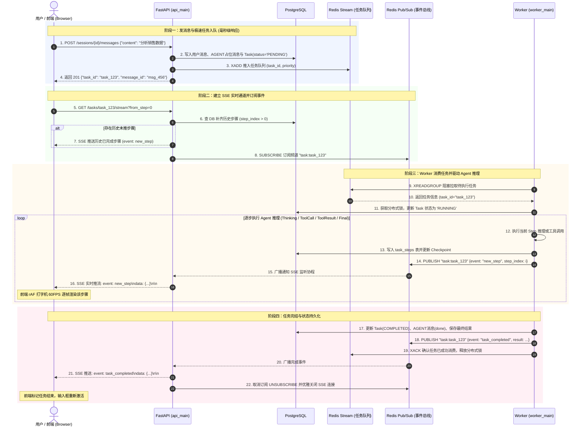

# 任务调度与实时推流完整时序图

```mermaid
sequenceDiagram
    autonumber
    actor User as 用户 / 前端 (Browser)
    participant API as FastAPI (api_main)
    participant DB as PostgreSQL
    participant Stream as Redis Stream (任务队列)
    participant PubSub as Redis Pub/Sub (事件总线)
    participant Worker as Worker (worker_main)

    %% 阶段一：发消息与任务入队
    rect rgb(240, 245, 255)
    Note over User, Stream: 阶段一：发消息与极速任务入队 (毫秒级响应)
    User->>API: 1. POST /sessions/{id}/messages {"content": "分析销售数据"}
    API->>DB: 2. 写入用户消息、AGENT占位消息与 Task(status='PENDING')
    API->>Stream: 3. XADD 推入任务队列 (task_id, priority)
    API-->>User: 4. 返回 201 {"task_id": "task_123", "message_id": "msg_456"}
    end

    %% 阶段二：SSE 连接建立与历史补齐
    rect rgb(245, 255, 245)
    Note over User, PubSub: 阶段二：建立 SSE 实时通道并订阅事件
    User->>API: 5. GET /tasks/task_123/stream?from_step=0
    API->>DB: 6. 查 DB 补齐历史步骤 (step_index > 0)
    alt 存在历史未推步骤
        API-->>User: 7. SSE 推送历史已完成步骤 (event: new_step)
    end
    API->>PubSub: 8. SUBSCRIBE 订阅频道 "task:task_123"
    end

    %% 阶段三：Worker 消费执行与步骤广播
    rect rgb(255, 250, 240)
    Note over Stream, Worker: 阶段三：Worker 消费任务并驱动 Agent 推理
    Worker->>Stream: 9. XREADGROUP 阻塞拉取待执行任务
    Stream-->>Worker: 10. 返回任务信息 (task_id="task_123")
    Worker->>DB: 11. 获取分布式锁，更新 Task 状态为 'RUNNING'

    loop 逐步执行 Agent 推理 (Thinking / ToolCall / ToolResult / Final)
        Worker->>Worker: 12. 执行当前 Step 推理或工具调用
        Worker->>DB: 13. 写入 task_steps 表并更新 Checkpoint
        Worker->>PubSub: 14. PUBLISH "task:task_123" {event: "new_step", step_index: i}
        PubSub-->>API: 15. 广播通知 SSE 监听协程
        API-->>User: 16. SSE 实时推流: event: new_step\ndata: {...}\n\n
        Note over User: 前端 rAF 打字机 60FPS 逐帧渲染该步骤
    end
    end

    %% 阶段四：任务完结与连接关闭
    rect rgb(255, 240, 245)
    Note over Worker, User: 阶段四：任务完结与状态持久化
    Worker->>DB: 17. 更新 Task(COMPLETED)、AGENT消息(done)、保存最终结果
    Worker->>PubSub: 18. PUBLISH "task:task_123" {event: "task_completed", result: ...}
    Worker->>Stream: 19. XACK 确认任务已成功消费，释放分布式锁
    PubSub-->>API: 20. 广播完成事件
    API-->>User: 21. SSE 推送: event: task_completed\ndata: {...}\n\n
    API->>PubSub: 22. 取消订阅 UNSUBSCRIBE 并优雅关闭 SSE 连接
    Note over User: 前端标记任务结束，输入框重新激活
    end
```
