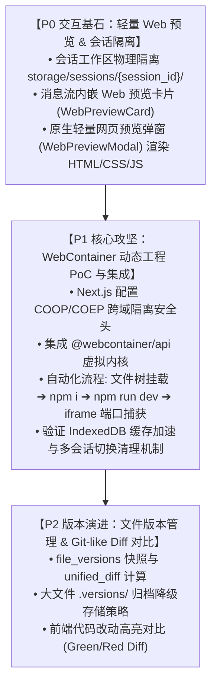
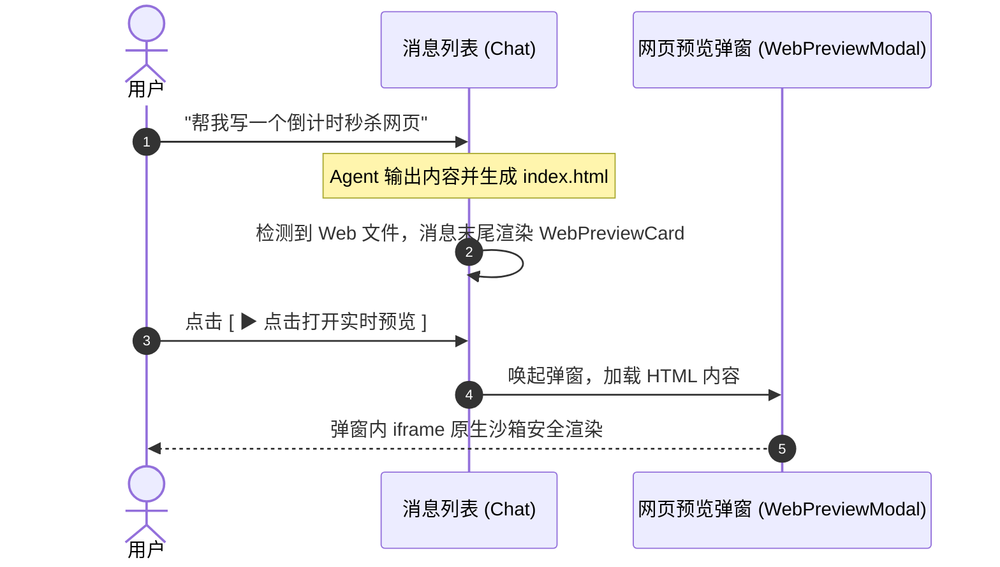
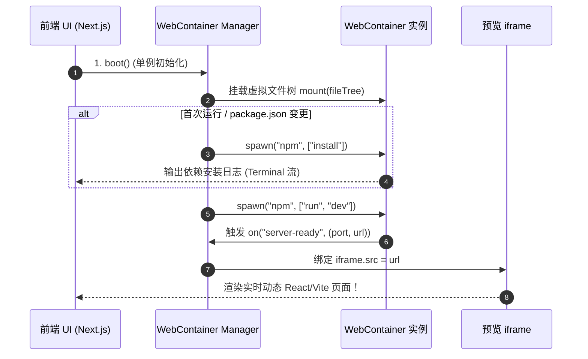

# 规范文档：Web 代码实时预览与 WebContainer 动态工程化执行 (Web Preview & WebContainer)

## 一、 背景与业务目标

### 1.1 业务背景
在当前的 AI Agent 编码系统中，LLM 具备写代码、修改文件并持久化入库（`v1.1.1` 文件管理系统）的能力。然而，用户在生成 HTML/CSS/JS 或 React/Vue 前端工程后，无法在当前界面直接运行和查看动态效果。

为了提供类似 **Bolt.new / Lovable / Claude Artifacts** 级别的极速交互体验，本功能旨在构建一个**低成本、零服务器算力负担、交互轻量清晰**的 Web 运行与预览体系：
1. **轻量交互体验**：在消息列表中生成可交互的 Web 预览卡片，点击即可在弹窗中渲染。
2. **多会话物理隔离**：按 `session_id` 独立归档工作区文件，杜绝跨会话覆盖与冲突。
3. **WebContainer 浏览器端虚拟工程化**：在用户浏览器中基于 WebAssembly 运行 Node.js 虚拟内核，实现 React/Vite 项目的自动化依赖安装与 Live Dev Server 启动。

---

## 二、 功能优先级路线图 (Priority Roadmap)



---

## 三、 详细设计方案

### 3.1 【P0】会话工作区物理隔离 (Session Storage Isolation)

#### 1. 物理目录结构
所有在沙箱或文件系统中落盘的文件，强制按照 `session_id` 进行分级归档：
```text
backend/storage/sessions/{session_id}/
├── index.html
├── package.json
├── src/
│   ├── App.tsx
│   └── main.tsx
└── public/
```
* **读写安全约束**：所有沙箱工具（如 `SandboxRunCommandTool`、`SandboxWriteFileTool`）执行时的 `cwd`（工作根目录）严格限定在对应 `session_id` 目录下，禁止跨目录越界访问。

---

### 3.2 【P0】消息列表 Web 预览卡片与轻量弹窗

#### 1. 交互流程


#### 2. 前端组件设计
* **`WebPreviewCard.tsx`**：
  * 嵌入在 Agent 消息气泡末尾。
  * 展示内容：应用名称、主文件入口（如 `index.html`）、文件总数、运行状态标签（`🟢 就绪`）。
  * 操作按钮：`[ ▶ 点击打开实时预览 ]`、`[ 📁 查看文件 ]`。
* **`WebPreviewModal.tsx`**：
  * 顶部工具栏：模拟浏览器地址栏（如 `http://localhost/preview`）、刷新按钮、设备视口切换（桌面端 / 移动端）。
  * 核心展示区：`<iframe sandbox="allow-scripts allow-forms allow-same-origin allow-modals" srcdoc={...} />`。

---

### 3.3 【P1】WebContainer 动态工程化可行性验证与集成

#### 1. 浏览器环境依赖配置 (Next.js Headers)
WebContainer 底层依赖 `SharedArrayBuffer`，必须在 `frontend/next.config.js` 配置跨域隔离安全头：
```javascript
// frontend/next.config.js
module.exports = {
  async headers() {
    return [
      {
        source: '/(.*)',
        headers: [
          { key: 'Cross-Origin-Opener-Policy', value: 'same-origin' },
          { key: 'Cross-Origin-Embedder-Policy', value: 'require-corp' },
        ],
      },
    ];
  },
};
```

#### 2. WebContainer 运行时调度生命周期 (WebContainer Manager)


#### 3. 会话切换与进程销毁处理 (Multi-session Cleanup)
* 切换会话时，前端捕获 `currentSessionId` 变化：
  1. 调用 `currentDevProcess.kill()` 终止上一会话的 Vite 进程。
  2. 请求 `/api/v1/sessions/{new_session_id}/files` 获取目标会话文件。
  3. 重新在目标会话子目录（或重置虚拟文件系统）中挂载并拉起开发服务。

---

### 3.4 【P2】文件版本管理与 Diff 变更对比（后续演进）

1. **数据库设计**：
   * 增加 `file_versions` 表，存储每次文件覆写时的全量内容与 unified_diff 补丁。
2. **大文件防爆策略**：
   * 小于 500KB：数据库直接存储。
   * 大于 500KB：自动归档到 `storage/sessions/{session_id}/.versions/` 压缩存储，不污染代码工作区。
3. **前端呈现**：
   * 集成 Monaco Diff Editor，提供类似 GitHub 的代码改动绿增红删对比。

---

## 四、 验收标准与测试用例

| 测试项 | 验收标准 |
| :--- | :--- |
| **会话目录隔离** | 会话 A 和会话 B 的代码文件存放在独立子目录下，互不覆盖 |
| **H5 消息卡片预览** | LLM 生成 `index.html` 后，消息气泡显示卡片，点击秒级弹出弹窗并正常运行 JS 动效 |
| **WebContainer PoC** | 包含 `package.json` 的 React/Vite 项目能在浏览器成功 `npm install` 并启动 dev server |
| **端口与预览绑定** | `server-ready` 捕获的虚拟端口能够被弹窗中的 iframe 稳定加载 |
| **会话切换清理** | 切换会话时，旧会话的 Node 进程被正确清理，新会话独立加载 |
